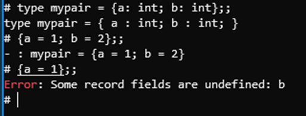
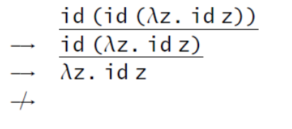
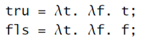
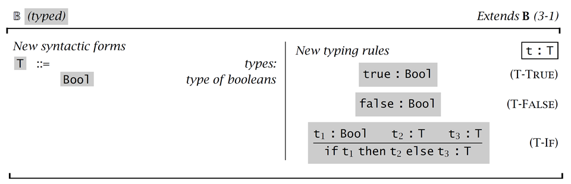
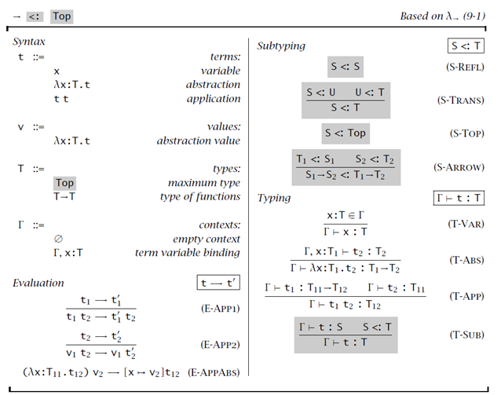

# OCaml

案例

链表去重

```ocaml
let rec compress = function
    | a :: (b :: _ as t) -> if a = b then compress t else a :: compress t
    | smaller -> smaller;;
    
# compress ["a"; "a"; "a"; "a"; "b"; "c"; "c"; "a"; "a"; "d"; "e"; "e"; "e"; "e"];;
- : string list = ["a"; "b"; "c"; "a"; "d"; "e"]
```

元素个数统计及

```ocaml
# let encode list =
    List.map (fun l -> (List.length l, List.hd l)) (pack list);;
val encode : 'a list -> (int * 'a) list = <fun>
    
# encode ["a"; "a"; "a"; "a"; "b"; "c"; "c"; "a"; "a"; "d"; "e"; "e"; "e"; "e"];;
- : (int * string) list =
[(4, "a"); (1, "b"); (2, "c"); (2, "a"); (1, "d"); (4, "e")]

```


重复元素个数

```ocaml
# let replicate list n =
    let rec prepend n acc x =
      if n = 0 then acc else prepend (n-1) (x :: acc) x in
    let rec aux acc = function
      | [] -> acc
      | h :: t -> aux (prepend n acc h) t in
    (* This could also be written as:
       List.fold_left (prepend n) [] (List.rev list) *)
    aux [] (List.rev list);;
    
# replicate ["a"; "b"; "c"] 3;;
- : string list = ["a"; "a"; "a"; "b"; "b"; "b"; "c"; "c"; "c"]
```

链表元素排列组合

```ocaml
# let rec permutation list =
    let rec extract acc n = function
      | [] -> raise Not_found
      | h :: t -> if n = 0 then (h, acc @ t) else extract (h :: acc) (n - 1) t
    in
    let extract_rand list len =
      extract [] (Random.int len) list
    in
    let rec aux acc list len =
      if len = 0 then acc else
        let picked, rest = extract_rand list len in
        aux (picked :: acc) rest (len - 1)
    in
    aux [] list (List.length list);;
    
# permutation ["a"; "b"; "c"; "d"; "e"; "f"];;
- : string list = ["a"; "e"; "f"; "b"; "d"; "c"]
```

质数检测

```ocaml
# let is_prime n =
    let n = abs n in
    let rec is_not_divisor d =
      d * d > n || (n mod d <> 0 && is_not_divisor (d + 1)) in
    n <> 1 && is_not_divisor 2;;

```

二叉树

```ocaml
# type 'a binary_tree =
    | Empty
    | Node of 'a * 'a binary_tree * 'a binary_tree;;
type 'a binary_tree = Empty | Node of 'a * 'a binary_tree * 'a binary_tree

# let example_tree =
    Node ('a', Node ('b', Node ('d', Empty, Empty), Node ('e', Empty, Empty)),
         Node ('c', Empty, Node ('f', Node ('g', Empty, Empty), Empty)));;
val example_tree : char binary_tree =
  Node ('a', Node ('b', Node ('d', Empty, Empty), Node ('e', Empty, Empty)),
   Node ('c', Empty, Node ('f', Node ('g', Empty, Empty), Empty)))
# let example_int_tree =
    Node (1, Node (2, Node (4, Empty, Empty), Node (5, Empty, Empty)),
         Node (3, Empty, Node (6, Node (7, Empty, Empty), Empty)));;
val example_int_tree : int binary_tree =
  Node (1, Node (2, Node (4, Empty, Empty), Node (5, Empty, Empty)),
   Node (3, Empty, Node (6, Node (7, Empty, Empty), Empty)))
```


修改变量


快速排序





# 无类型算术表达式

语法树结点个数 size(t)：


语法书结点深度：


# Lambda 演算

三种规约方式：

Full beta-reduction：


正则顺序：每次选择最左、最外侧的redex


传名：严格从外侧归约，函数抽象中不进行归约



传值：函数参数先归约，也就是说先参数求值再计算函数


## Church encodes




## 替换规则


# 简单类型表达式


**引理**：类型关系的倒置 (Inversion of the type relation)


性质：

可靠性/安全性/Soundness/Safty

- Well-typed terms求值不会出错
- 不会到达stuck state

由两个定理来保证可靠性：

- Progress: A well-typed term is not stuck. 要么是一个value，要么存在一条规则进行求值
- Preservation: 一个well-typed term经过若干次求值得到的新term也是well-typed的

例：推断 (λx:Bool .x) true的类型


**引理**：类型关系的倒置


# 简单扩展

## 基本类型

使用抽象的A,B,C这样的符号表示不同的基本类型


例：

λx:A. x

λx:B. x

λf:A→A. λx:A. f(f(x))

## The Unit Types


$t_1;t_2$ 可以看作 $(λx:Unit. t_2 ) t_1$ 的缩写，是一种派生型(derived form)，又称为语法糖(syntactic sugar) 

**通配符(Wildcard)**

- 一种语法糖

- 表示不会在函数抽象中使用到的参数

- 用通配符”_”表示这样的参数

- $λ\_:S. t$ 是 $λx:S. t$ 的缩写，其中 x 不在 t 中出现

## 类型归属(Ascription)


## Let 绑定 (Let Bindings)


## Pairs


## Tuples


## 记录


## Sums


## Variants

将sum types加上标签，可以泛化为variants

$T_1+T_2⟹<l_1:T_1,l_2:T_2>$

$inl\;t \; as\; T_1+T_2⟹<l_1=t>as<l_1:T_1,l_2:T_2>$


## 链表


## 引用


## 异常处理


# 子类型

## 性质

引理：

- 如果 $S<:T_1→T_2$，那么 $S$ 具有 $S_1→S_2$ 的形式，其中 $T_1<:S_1，S_2<:T_2$ 。

- 如果 $S<:\{l_i:T_i^{(i∈1..n)}\}$，那么S具有 $\{k_j:S_j^{(j∈1..m)}\}$ 的形式，其中 $\{l_i^{(i∈1..n)}\}⊆ \{k_j^{(j∈1..m)}\}$，且对每个共同的标签 $l_i=k_j$ 都有 $S_j<:T_i$。

# 递归类型

利用运算符μ表示递归与重复的部分

【例】

- $NatList=μX. <nil:Unit, const\;\{Nat,X\}>;$

- 令 NatList 为一个无穷类型，满足方程 $X=<nil:Unit, const\;\{Nat,X\}>$


【例】

一个hungry函数，接收一个参数，然后返回一个函数，返回的函数仍然是一个hungry函数：

 $Hungry=μA. Nat→A;$


【例】

$Stream=μA. Unit→\{Nat,A\};$


## 形式化定义


【例】


# 多态

类型变量与替换。为了实现多态，可以使用一些变量作为占位符，需要的时候再替换成实际的类型。

类型的替换由两部分组成：

- 声明一个映射σ，将类型变量映射到具体的类型

- 应用一次映射T，得到一个实例σ T

【例】

$σ=[X↦Bool,Y↦Nat,Z↦Nat→Bool]$

$σ (X→X)=Bool→Bool$

## System F


【例】多态链表


【例】二叉树


# 求值规则





## 子类型




## lso-recursive 


## 约束求解


