# ARM 汇编

ARM 指令分为三类：

## 数据处理指令

算术运算

```assembly
ADD r0, r1, r2 ; r0 := r1 + r2
ADC r0, r1, r2 ; r0 := r1 + r2 + C
SUB r0, r1, r2 ; r0 := r1 - r2
SBC r0, r1, r2 ; r0 := r1 - r2 + C - 1
RSB r0, r1, r2 ; r0 := r2 - r1
RSC r0, r1, r2 ; r0 := r2 - r1 + C - 1
```

C is the C bit in the CPSR.

逻辑运算

```assembly
AND r0, r1, r2 ; r0 := r1 and r2
ORR r0, r1, r2 ; r0 := r1 or r2
EOR r0, r1, r2 ; r0 := r1 xor r2
BIC r0, r1, r2 ; r0 := r1 and not r2 -->bit clear
```

数据移动

```assembly
MOV r0, r2 ; r0 := r2
MVN r0, r2 ; r0 := not r2
```

比较指令

```assembly
CMP r1, r2 ; set cc on r1 - r2
CMN r1, r2 ; set cc on r1 + r2
TST r1, r2 ; set cc on r1 and r2
TEQ r1, r2 ; set cc on r1 xor r2
```

These instructions just affect the condition codes (N, Z, C, V) in the CPSR.

立即数

```assembly
ADD r3, r3, #1 		; r3 := r3 + 1
AND r8, r7, #&ff    ; r8 := r7[7:0]
```

`&ff` 和 `0xff ` 代表十六进制。

带上移位操作和设置标志位

```assembly
ADD r3, r2, r1, LSL #3 ; r3 := r2+(r1<<3)
ADD r5, r5, r3, LSL r2 ; r5 += r3<<r2
ADDS r2, r2, r0 ; 32-bit carry-out -> C
ADC r3, r3, r1 ; added into top 32 bits
```

S means ‘Set condition codes’.

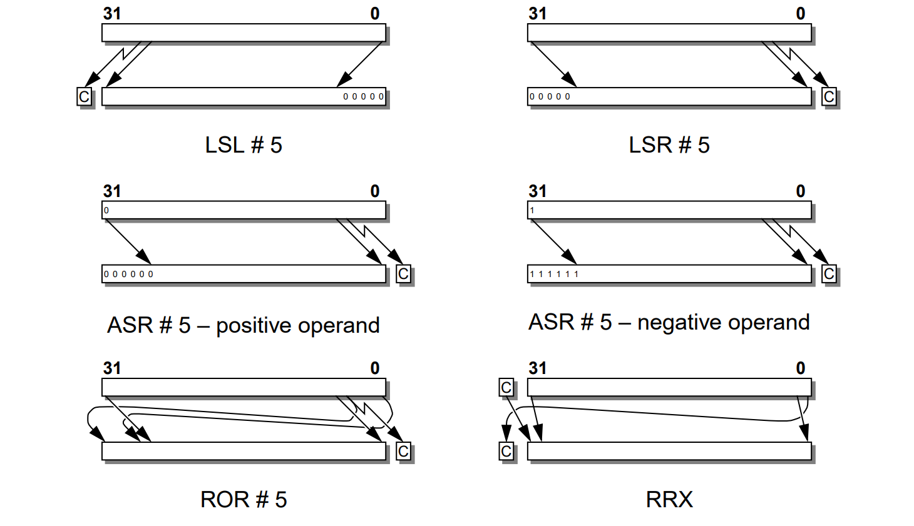

乘法

```assembly
MUL r4, r3, r2     ; r4 := (r3 x r2)[31:0]
MLA r4, r3, r2, r1 ; r4 := (r3xr2+r1)[31:0]
```


## 数据传送指令

```assembly
LDR r0, [r1] ; r0 := mem[r1]
STR r0, [r1] ; mem[r1] := r0
LDR r0, [r1,#4] ; r0 := mem[r1+4]
LDR r0, [r1,#4]! 	; r0 := mem[r1+4]
					; r1 := r1 + 4
LDR r0, [r1], #4 	; r0 := mem[r1]
					; r1 := r1 + 4
```

半字和字节

```assembly
LDRB r0, [r1] 	; r0 := mem8[r1]
LDRSH r0, [r1] 	; r0 := mem16[r1](signed)
```

初始化地址寄存器伪指令

```assembly
		ADR r1, TABLE1 ; r1 points to TABLE1
		..
TABLE1 	; LABEL
```

批量操作与堆栈

```assembly
LDMIA r1, {r0,r2,r5} 	; r0 := mem[r1]
						; r2 := mem[r1+4]
						; r5 := mem[r1+8]
```

- the lowest register always uses the lowest address, and so on, in increasing order
- it doesn’t matter how the registers are ordered in `{…}`


Multiple register loads and stores (…ctd)

 ❍ stack addressing: 

– stacks can **A**scend or **D**escend memory 

– stacks can be **F**ull or **E**mpty 

– ARM multiple register transfers support all forms of stack 

❍ block copy addressing 

– addresses can **I**ncrement or **D**ecrement 

– **B**efore or **A**fter each transfer

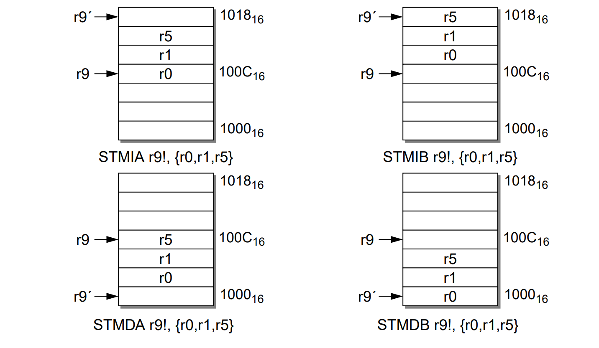

## 控制流指令

```assembly
		B LABEL
		.. ; these instructions are skipped
LABEL 	..
```

例子：

```assembly
		MOV r0, #0 		; initialise counter
		..
LOOP    ADD r0, r0, #1 	; increment counter
		CMP r0, #10 	; compare with limit
		BNE LOOP 		; repeat if not equal
		.. 				; else continue
```


链接跳转

```assembly
		BL SUBR 	; branch to SUBR
		.. 			; return to here
SUBR 	.. 			; subroutine entry point
		MOV pc, r14 ; return
```

- ARM’s subroutine call mechanism 
- saves the return address in r14（link register）

条件执行：

```assembly
CMP   r0, #5 		; if (r0 != 5) {
ADDNE r1, r1, r0 	; r1 := r1 + r0 - r2
SUBNE r1, r1, r2 	; }
```

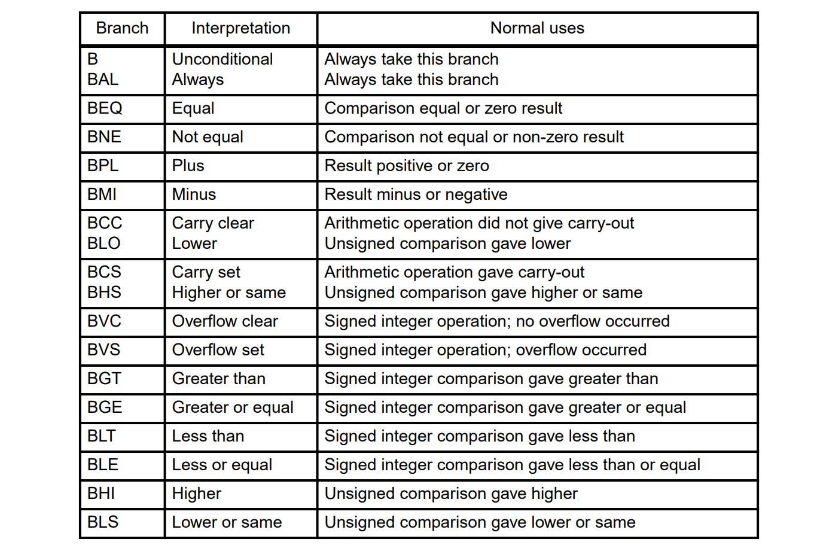

软件中断

```assembly
SWI SWI_Angel ; call Angel monitor
```

`SWI_Angel` 为中断处理程序入口，最多 24 位立即数。


## 常用等价指令

```assembly
MVN R0, R0 					; R0 := not(R0)
RSB R0, R0, #0 				; R0 := 0 - R0

MOV PC, LR 					; ‘Leaf’ return
LDR PC, [SP], #4 			; Unstack PC

STMFD SP!, {register list}	; Push
LDMFD SP!, {register list}	; Pop

MOV R0, R0, LSL #5 			;
MOV R0, R0, ASR R1 			; etc.
```


## 完整汇编程序

Assembler details to note: 

❍ AREA：declaration of code area 

❍ EQU：initialising constants. Used here to define SWI number 

❍ ENTRY: code entry point 

❍ =, DCB, DCD: ways to initialise memory 

❍ END: the end of the program source 

❍ labels are aligned left 

❍ opcodes are indented


Example1: “Hello World” assembly program:

```assembly
			AREA HelloW,CODE,READONLY	; declare area
SWI_Angel 	EQU 0x123456 				; Angel SWI number
			ENTRY 						; code entry point
START 		ADR r1, TEXT-1				; r1 -> “Hello World” -1
LOOP 		MOV r0, #0x3 				; Angel write char in [r1]
			LDRB r2, [r1,#1]! 			; get the next byte
			CMP r2, #0 					; check for text end
			SWINE SWI_Angel 			; if not end print ..
			BNE LOOP 					; .. and loop back
			MOV r0, #0x18 				; Angel exception call
			LDR r1, =0x20026 			; Exit reason, r1=0x20026
			SWI SWI_Angel 				; end of execution
TEXT 		= “Hello World”,0xA,0xD,0
			END 						; end of program sourc
```


Example2 

```assembly
;Scan a series of 32 bit numbers to find how many are negative
		AREA Program, CODE, READONLY
		ENTRY
Main
		LDR R0, =Data1               ;load the address of the lookup table
		EOR R1, R1, R1               ;clear R1 to store count
		LDR R2, Length               ;init element count
		CMP R2, #0
		BEQ Done                     ;if table is empty
Loop
		LDR R3, [R0]                 ;get the data
		CMP R3, #0
		BPL Looptest                 ;continue R3 >=0
		ADD R1, R1, #1               ;increment result
Looptest
		ADD R0, R0, #4               ;increment pointer
		SUBS R2, R2, #0x1            ;decrement count with zero set
		BNE Loop                     ;if zero flag is not set, loop
Done
		STR R1, Result               ;otherwise done - store result
		SWI &11
	
		AREA Data1, DATA
	
Table 	DCD &F1522040          		 ;table of values to be added
		DCD &7F611C22
		DCD &80000242
TablEnd DCD 0
	
		AREA Data2, DATA
Length 	DCW (TablEnd - Table) / 4	;because we're having to align
		ALIGN                       ;gives the loop count
Result 	DCW 0                 		;storage for result

		END
```


Example 3:

```c
int gcd (int i, int j)
{
	while (i!=j)
	{
		if (i>j)
			i -= j;
		else
			j -= i;
	}
}
```

```assembly
; GCD
Loop 	CMP R1, R2
		SUBGT R1, R1, R2
		SUBLT R2, R2, R1
		BNE loop
```


Example4:

```assembly
;Scan a series of 16 bit numbers to find the largest
		AREA Program, CODE, READONLY
		ENTRY
Main
		LDR R0, =Data1               ;load the address of the lookup table
		EOR R1, R1, R1               ;clear R1 to store count
		LDR R2, Length               ;init element count
		CMP R2, #0
		BEQ Done                     ;if table is empty
Loop
		LDR R3, [R0]                 ;get the data
		CMP R3, R1					 ;SUBS R3, R1
		BLE Looptest                 ;continue
		MOV R1, R3               	 ;R3 is larger
Looptest
		ADD R0, R0, #4               ;increment pointer
		SUBS R2, R2, #0x1            ;decrement count with zero set
		BNE Loop                     ;if zero flag is not set, loop
Done
		STR R1, Result               ;otherwise done - store result
		SWI &11
	
		AREA Data1, DATA
	
Table 	DCW &F1522040          		 ;table of values to be added
		ALIGN
		DCW &7F611C22
		ALIGN
		DCW &80000242
		ALIGN
TablEnd DCD 0

		AREA Data2, DATA
		
Length 	DCW (TablEnd - Table) / 4	;because we're having to align
		ALIGN                       ;gives the loop count
Result 	DCW 0                 		;storage for result

		END
```


## 参考资料

- [02_ARMassembly.pdf (manchester.ac.uk)](http://apt.cs.manchester.ac.uk/ftp/pub/apt/peve/PEVE05/Slides/02_ARMassembly.pdf)

- [ARM Assembly Language Programming (uam.es)](http://arantxa.ii.uam.es/~gdrivera/sed/docs/ARMBook.pdf)

# S3C2410 存储系统与 IO

## 存储容量的扩展

【基本思路】

微处理器与随机存储器接口的信号线一般有：

- 片选信号线CE：用于选中该芯片 。

- 读/写控制信号线OE和WE：控制芯片数据引脚的传送方向。

- 地址线：用于指明读/写单元的地址。 

- 数据线：双向信号线，用于数据交换。

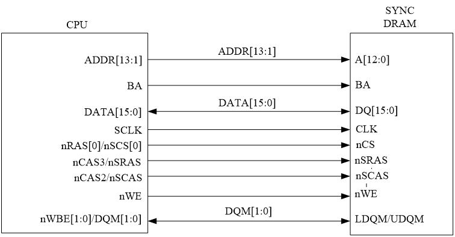

【按位扩展】

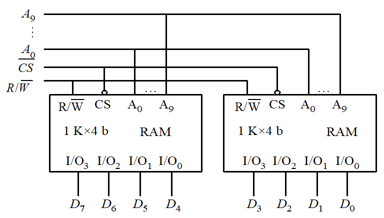

【按字扩展】

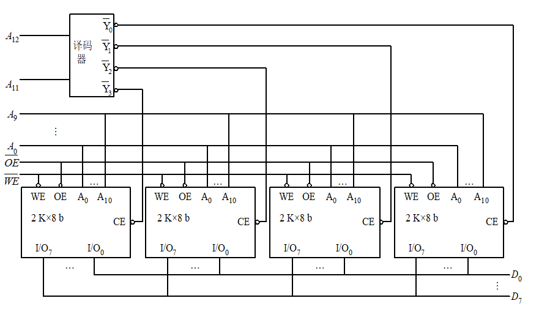

## 51 单片机存储扩展

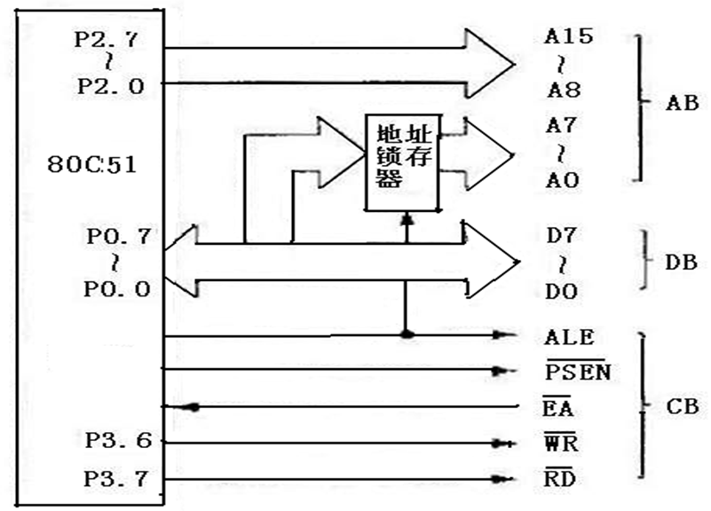

（1）以P0口的8位口线作地址/数据线，此处的地址是指系统的低8位地址。
P0口线既作地址线使用又作为数据线使用，具有双重功能。因此需采用复用技术，对地址和数据进行分离，为此在构造地址总线时要增加一个8位锁存器。首先由锁存器暂存并为系统提供8位地址，其后P0口线就作为数据线使用。
一般选择高电平或下降沿选通的锁存器作为地址锁存器，常用的器件有74LS273、74LS373（见图所示）。
当ALE为高电平时，八D锁存器74LS373的输入和输出是透明的。当ALE出现下降沿后，八D锁存器74LS373的输出即为A0～A7，这时P0口上出现的是数据，实现了地址低8位和数据线的分离。
单片机P0口的电路逻辑已考虑了地址和数据复用的需要，口线电路中的多路转接电路MUX及地址/数据控制就是为此目的而设计的。

（2）以P2口的口线作高位地址线
若使用P2口的全部8位口线，再加上P0口提供的低8位地址，则形成了完整的16位地址总线。使单片机系统的扩展寻址范围达到64K单元。
实际应用系统中，高位地址线并不固定为8位地址，而是根据需要用几位就从P2口中引出几条口线。
（3）控制信号
除了地址线和数据线，在扩展系统中还需要单片机提供一些控制信号线，以构成扩展系统的控制总线。
这些信号有的是单片机引脚的第一功能信号，有的则是第二功能信号。
包括：
ALE：输出P0口上地址与数据隔离信号，用于锁存P0口输出的低8位地址的控制线。通常，用ALE电平信号的下降沿控制锁存器来锁存地址数据。
/PSEN：输出。用于读片外程序存储器（EPROM）中的数据。“读”取EPROM中数据（指令）时，不能用/RD信号，而只用/PSEN信号。
/EA：输入。用于选择片内或片外ROM。当/EA＝0时，只访问外部程序存储器。当 /EA＝1时，先访问内部程序存储器，内部程序存储器全部访问完之后，再访问外部程序存储器。
/RD、/WR：输出。用于片外数据存储器（RAM）的读、写控制。当执行片外数据存储器操作指令MOVX时，自动生成/RD 或 /WR 控制信号
可以看出，尽管80C51并行8位I/O口有4个，但是由于系统扩展的需要，真正能作为数据I/O使用的只剩下P1口和P3口的部分口线了。

【64K全地址译码电路】      

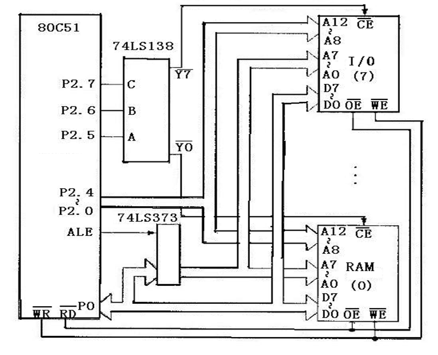

【单片EPROM的扩展电路】

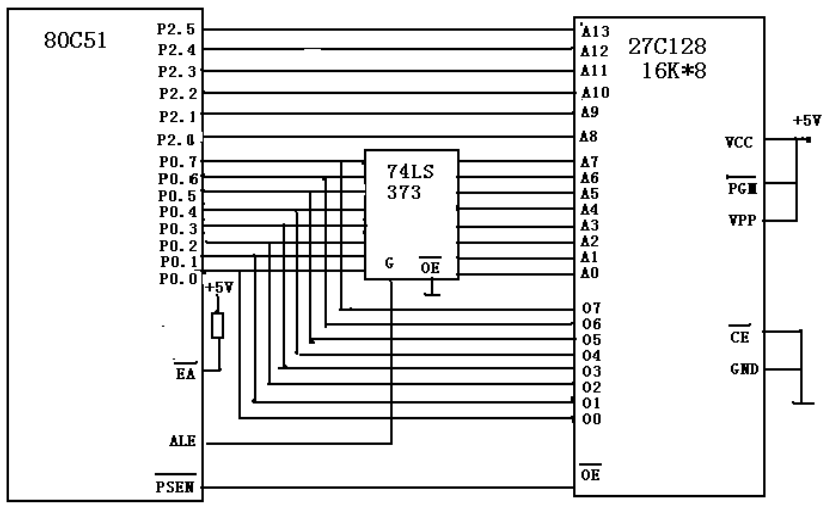

【扩展2KB数据存储器的线路图】

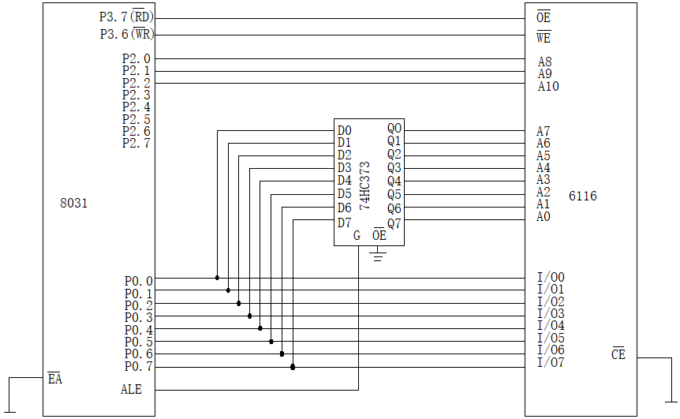

【扩展16KB RAM和16KB EPROM】

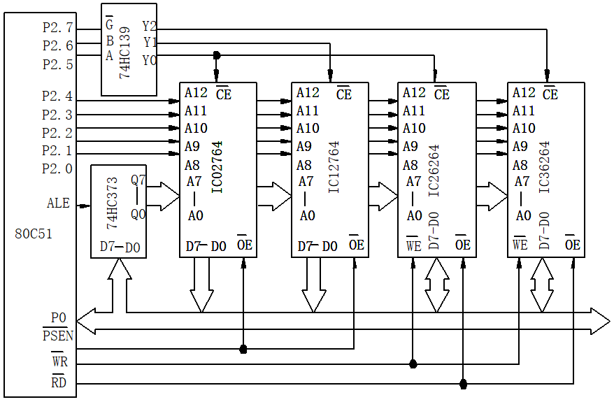

## 高速缓存机制(CACHE)

- 高速缓存控制器是微处理器用于控制访问高速缓存及主存系统的桥梁，它处于微处理器和高速缓存及主存系统之间

- 用于解决主存访问速度与CPU处理速度不相匹配的一种部件（由集成于CPU芯片中的专门的高速存取电路实现）。

- 或用于解决辅存访问速度与CPU处理速度不相匹配的一种部件（由主存的一部分实现）。

- 需要解决缓存内容与原内容不一致的问题

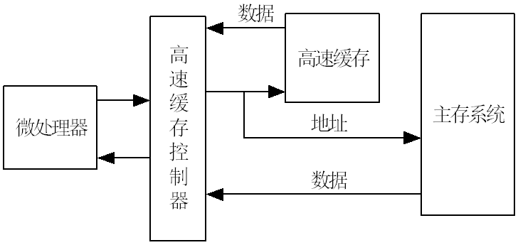


## 存储管理单元(MMU)

- 存储管理单元（MMU）是集成在微处理器芯片内部、专门管理外部存储器总线的一部分硬件。主要用来完成虚实地址之间的转换。越来越多的微处理器芯片均带有MMU。
- MMU完成的主要功能有：

	- 将主存地址从虚拟存储空间映射到物理存储空间。
	- 每个用户进程拥有自己独立的地址空间，并通过内存访问权限的检查保护每个进程所用的内存不被其他进程破坏
	- 大程序可以在较小的内存空间中运行，因此可以同时装入更多的程序并发执行

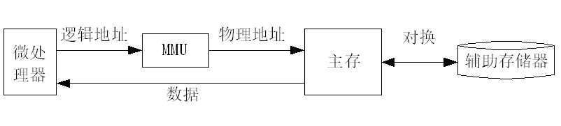

MMU管理方式：

- 分段方式：分段方式支持较大的、任意大小的内存区域

- 分页方式：分页方式支持较小的、固定大小的内存区域

- 段页方式：段页方式介于分段方式和分页方式之间


## SDRAM/SRAM 接口信号

1）`nSRAS`(SDRAM Row Address Strobe, O): SDRAM行地址选通

2） `nSCAS`(SDRAM Column Address Strobe, O): SDRAM列地址选通

3） `nSCS[1:0]`(SDRAM Chip Select, O): SDRAM片选

4） `DQM[3:0]`(SDRAM Data Mask, O): SDRAM数据掩码

5） `SCLK[1:0]`(SDRAM Clock, o): SDRAM时钟

6） `SCKE[1:0]`(SDRAM Clock Enable, O): SDRAM时钟使能

7）`nBE[3:0]`(Upper Byte/Lower Byte Enable (In case of 16-bit SRAM), O): 使用16位SRAM时, 用作高字节/低字节使能信号

8） `nWBE[3:0]`(Write Byte Enable): 写字节使能

## NAND Flash 接口信号

1）`CLE`(Command Latch Enable, O):命令锁存允许

2） `ALE`(Address Latch Enable, O): 地址锁存允许

3） `nFCE`(NAND Flash Chip Enable, O): NAND Flash芯片使能

4） `nFRE`(NAND Flash Read Enable, O): NAND Flash读允许

5） `nFWE`(NAND Flash Write Enable, O):NAND Flash写允许

6） `nCON`(NAND Flash Configuration, O):NAND Flash配置

7） `R/nB`(NAND Flash Ready/Busy, O):NAND Flash准备就绪/忙

## 2410存储空间

S3C2410芯片采用的是ARM920T核，理论上地址空间总共有4GB ( $2^{32}$ ) 。

但其中有3GB的空间都预留给处理器内部的寄存器和其他设备了。

留给外部可寻址的存储器空间是1GB，也就是0x00000000~0x3FFFFFFF总共有30根地址线

 这1G空间被分成8个存储块，每块(bank) 128MB。

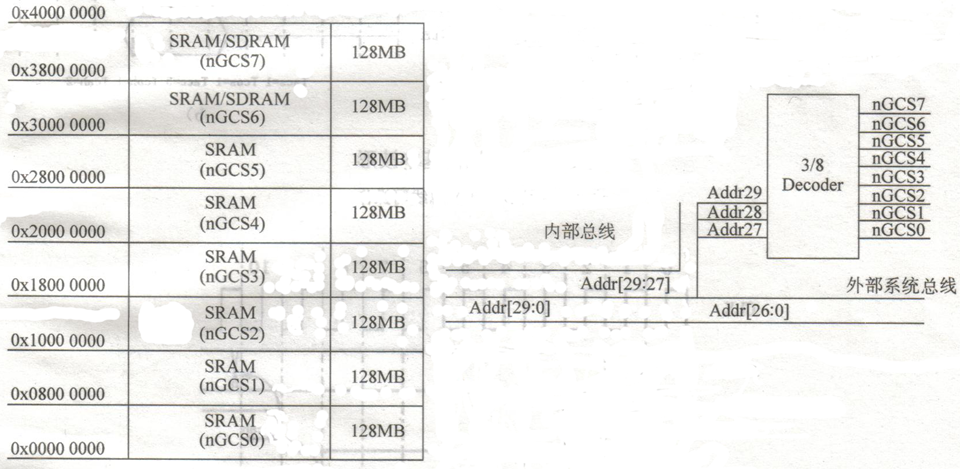


扩展示例

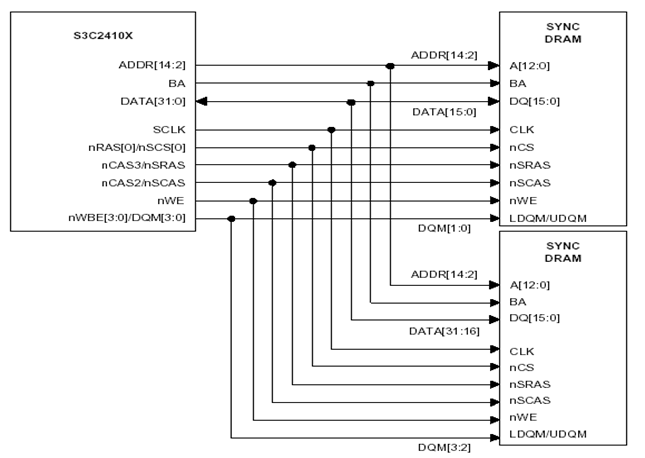

## S3C2410 存储空间特点

- 支持小端／大端模式（可通过软件选择）。

- 8个存储块中，6个用于SRAM或ROM，另2个用于SDRAM、SRAM、ROM。

- 8个存储块中，7个存储块有固定起始地址，1个存储块起始地址可变。

- 支持异步定时，可用nWAIT(等待)信号来扩展外部存储器的读／写周期。

- 可编程的总线访问宽度8/16/32位，但Bank0不能通过软件编程方式设置。

- 在SDRAM中支持自主刷新和省电模式。

- 所有存储器Bank可编程访问周期。

## NAND Flash 控制器及 NAND Flash 的寻址

1）因为没有统一的接口标准，NAND Flash与微处理器间的接口较复杂。

2）NAND Flash接口信号分为三类：数据线、控制线和状态线。

3）NAND Flash接口信号比较少，其数据线的宽度只有8位。

4）NAND Flash无地址线，另外多出了命令锁存允许信号 CLE (Command Latch Enable: 写操作时给出此信号表示进行写命令操作)和地址锁存允许信号 ALE (Address Latch Enable: 写操作时给出此信号表示进行写地址或数据操作)用来区分总线上的数据类型。

5.就绪/忙信号`R/nB`(Nand Flash Ready/Busy)用于表示器件的工作状态。当数据写入、编程或随机读取时，R/nB为低电平，表示NAND Flash芯片正忙，否则输出高电平。

## 端口寄存器

【端口A寄存器及引脚配置】

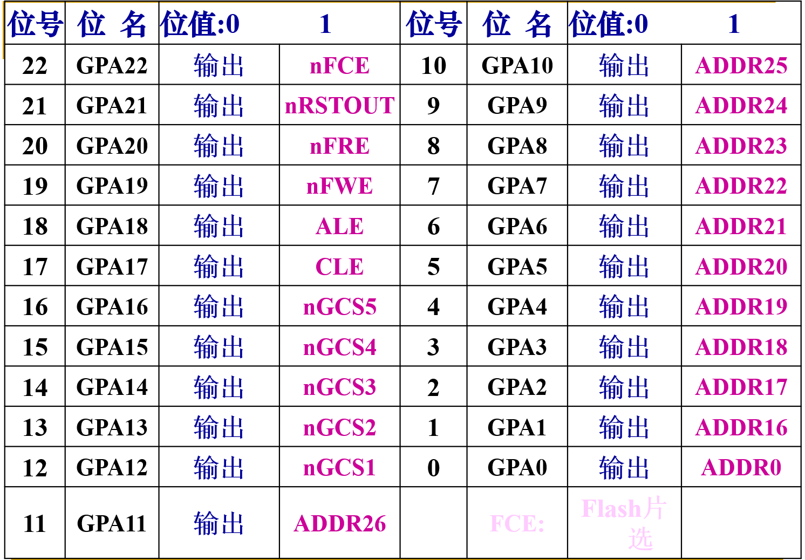

【端口B引脚配置寄存器】

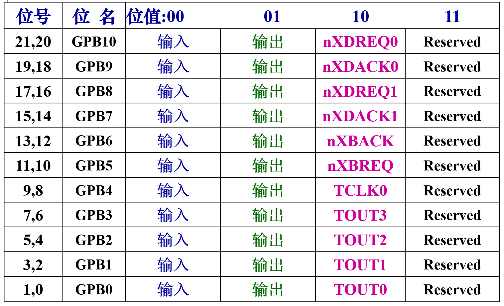

【端口F引脚配置寄存器】

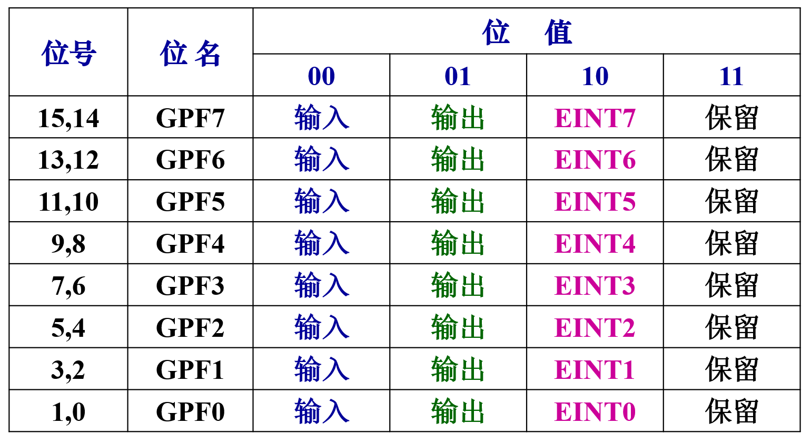

## 端口应用举例

```c
#include "def.h"
#include "2410lib.h"
#include "isr.h"
#define ledlight()    { rGPEDAT = rGPEDAT & 0xfff7 }
#define ledclear()    { rGPEDAT = rGPEDAT | 0x0008 }

void Main()
{
	BoardInitStart();       //系统初始化，MMU初始化
 	SystemClockInit();      //系统时钟初始化
  	rGPECON = （ rGPECON | 0x00000140 ）& 0xfffffd7f  //GPIO E 初始化
    while（1）
    {
        ledlight（）；         //LED灯亮
        Delay（3000）；        //延时
        ledclear（）；  		//LED灯灭
    }
}
```


# S3C2410 中断

## 中断优点

- 中断可以解决快速的 CPU 与慢速的外设之间的矛盾，使 CPU 和外设同时工作。
- CPU在启动外设工作后继续执行主程序，同时外设也在工作。每当外设做完一件事就发出中断申请，请求 CPU 中断它正在执行的程序，转去执行中断服务程序（一般情况是处理输入/输出数据），中断处理完之后，CPU 恢复执行主程序，外设也继续工作。CPU 可启动多个外设同时工作，大大地提高了 CPU 的效率。
- 在实时控制中，现场的各种参数、信息均随时间和现场变化。这些外界变量可根据要求随时向 CPU 发出中断申请，请求 CPU 及时处理中断请求。如中断条件满足，CPU 马上就会响应，进行相应的处理，从而实现实时处理。
- 针对难以预料的情况或故障，如掉电、存储出错、运算溢出等等，可通过中断系统由故障源向 CPU 发出中断请求，再由 CPU 转到相应的故障处理程序进行处理。

## 中断响应的一般过程

(1) 在每条指令结束后, 系统都自动检测中断请求信号, 如果有中断请求，且CPU处于开中断状态下, 则响应中断。

(2) 保护现场, 在保护现场前, 一般要关中断, 以防止现场被破坏。保护现场是用堆栈指令将原程序中用到的寄存器推入堆栈。

(3) 中断服务, 即为相应的中断源服务。

(4) 恢复现场, 用堆栈指令将保护在堆栈中的数据弹出来, 在恢复现场前要关中断, 以防止现场被破坏。在恢复现场后应及时开中断。

(5) 返回, 此时 CPU将推入到堆栈的断点地址弹回到程序计数器, 从而使CPU继续执行刚才被中断的程序。


## S3C2410中断系统

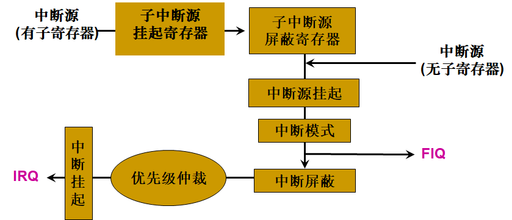

中断处理流程：

INT_TIMER0、INT_TIMER2和INT_UART0三个中断被同时触发，此时3个中断信号流向**SRCPND**寄存器，使该寄存器中的第10位，12位，28位被置为1；

中断信号继续向前流经**INTMODE**，这三个中断皆为IRQ类型，于是信号进一步流经**INTMASK** 寄存器，这三个中断都没有被屏蔽，故中断信号继续向前流向**PRIORITY**寄存器；

经过优先级判断，INT_TIMER0中断信号使**INTPND**寄存器的第10位置1(INT_TIMER0优先级最高)，此时**INTOFFSET** 寄存器的值为10，CPU转向相应的中断服务例程进行处理。

处理完毕后，程序将**INTPND**和**SRCPND**的第10置为0，至此INT_TIMER0中断处理完毕。此时**SRCPND** 的第12位，28位仍为1（这两个中断请求未被处理），故它们会继续被CPU按刚才所描述的过程进行处理。


## S3C2410的中断

- S3C2410 的中断包含有 IRQ 和 FIQ。IRQ是普通中断，FIQ是快速中断，FIQ的优先级高于IRQ。FIQ中断通常在进行大批量的复制、数据传输等工作时使用。

- S3C2410 通过对程序状态寄存器(PSR)中的 `F` 位和 `I` 位进行设置控制CPU的中断响应。如果设置PSR的 `F` 位为1，则 CPU不会响应来自中断控制器的FIQ中断；如果设置PSR的 `I` 位为1，则CPU不会响应来自中断控制器的IRQ中断。如果把PSR的F位或I位设置为0，同时将中断屏蔽寄存器（INTMSK）中的相对应位设置为0，CPU响应来自中断控制器的IRQ或FIQ中断请求。

- S3C2410有SRCPND(中断源挂起寄存器)和INTPND(中断挂起寄存器)两个中断挂起寄存器。SRCPND和INTPND两个挂起寄存器用于指示某个中断请求是否处于挂起状态。当多个中断源请求中断服务时，SRCPND寄存器中的相应位设置为1，优先级仲裁过程结束后INTPND寄存器中只有1位被自动设置为1。
- S3C2410中的中断控制器能够接收来自56个中断源的请求，这些中断源来自片内外部中断如DMA控制器、UART、I2C等及外部中断引脚两大类。
- S3C2410采用了中断共享技术，INT_UARTO、INT_UART1、INT_UART2、EINT8_23和EINT4_7为多个中断源共享使用的中断请求信号。
- 中断请求的优先级逻辑是由7个仲裁器组成的，其中包括6个一级仲裁器和1个二级仲裁器。每个仲裁器是否使能由寄存器PRIORITY[6:0]决定。每个仲裁器可以处理4~6个中断源，从中选出优先级最高的。优先级顺序由寄存器PRIORITY[20:7]的相应位决定。


## 中断控制寄存器

【EXTINT0---外中断触发方式控制寄存器0】

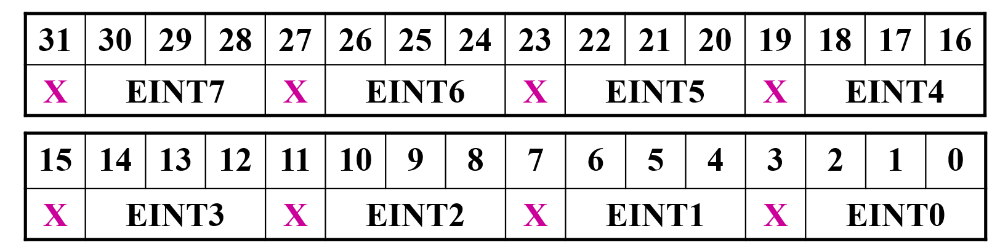

EINT0~7---中断请求信号触发方式选择
		000：低电平触发		001：高电平触发		
		01x：下降沿触发		10x：上升沿触发
		11x：双边沿触发
第3、7、11、15、19、23、27、31位---保留

【EXTINT1---外中断触发方式控制寄存器1】

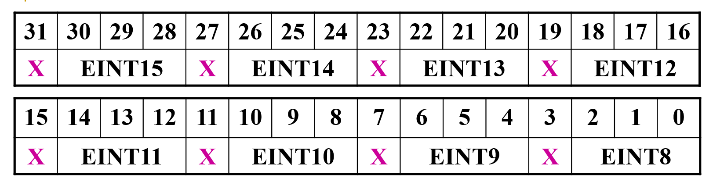


## 中断编程模式

编程实施：采用C语言，模块化设计

1.系统初始化函数 `SystemInit()`

2.中断初始化函数 `Isr_Init()`

3.中断向量注册函数 `Irq_Request(irq_no, void *irq_routine)`

4.开中断函数 `Irq_Enable(int irq_no)`

5.清断中断标志函数 `Irq_Clear(int irq_no)`

6.中断处理函数 `Eint2_isr()`

7.主程序 `main()`

```c
void Isr_Init(void)
{
    pISR_UNDEF = (unsigned)HaltUndef;
    pISR_SWI = (unsigned)HaltSwi;
    pISR_PABORT = (unsigned)HaltPabort;
    pISR_DABORT = (unsigned)HaltDabort;

    rINTMOD = 0x0;               // IRQ中断模;
    rINTMSK = BIT_ALLMSK;        //屏蔽所有中断
    rINTSUBMSK = BIT_SUB_ALLMSK; //屏蔽所有子中断
}

void Irq_Request(int irq_no, void *irq_routine)
{
    if (irq_no >= IRQ_MIN && irq_no <= IRQ_MAX)
        *(unsigned int *)((irq_no - 1) * sizeof(unsigned int) + (unsigned int)(_ISR_STARTADDRESS + 0x20)) = (unsigned int)irq_routine;
}

void Irq_Enable(int ira_no)
{
    if (ira_no >= IRQ_MIN && irq_no <= IRQ_MAX)
        rINTMSK &= ~(1 << (irq_no - 1));
}

void Irq_Clear(int ira_no)
{
    rSRCPND = 1 << (irq_no - 1); //清中断请求寄存器
    rINTPND = 1 << (irq_no - 1); //清中断允许寄存器
}

void eint2_isr(void)
{
    Irq_Clear(IRQ_EINT2); //中断清除
    //中断处理操作
}

void Main(void)
{
    BoardInitStart();                  //系统初始化,MMU 初始化
    SystemClockInit();                 //系统时钟初始化
    PortInit();                        // GPIO 初始化
    Isr_Init();                        //中断初始化
    Irq_Request(IRQ_EINT2, eint2_isr); //中断请求
    Irq_Enable(IRQ_EINT2);             //使能中断
    while (1)
    {
        //主程序
    }
}
```

## 定时器中断案例

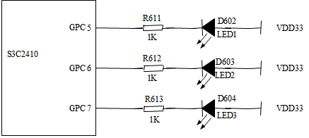

```c
void Timer1_init(void)
{
    rGPCCON = (rGPCCON | 0x00000001) & 0xfffffffd;
    //配置GPC0口线为输出
    // rGPCCON: Port C control
    rGPCDAT = rGPCDAT | 0x00000001; // rGPCDAT: Port C data

    rTCFG0 = 255;                           // rTCG0:Timer 0/1 configuration
    rTCFG1 = 0x01 << 4;                     // rTCG1:Timer 1 configuration
    rTCNTB1 = 48828;                        // rTCNTB1:Timer count buffer1
                                            // 在pclk = 50MHz下, 1s的记数值
                                            // rTCNTB1 = 50000000/4/256=48828
    rTCMPB1 = 0x00;                         // rTCMPB1:Timer compare buffer 1
    rTCON = (1 + 11) | (1 << 9) | (0 << 8); //禁用定时器1, 手动加载
    rTCON = (1 + 11) | (0 << 9) | (1 << 8); //启动定时器1, 自动加载
}

void Timer1INT_Init(void)
{                             //定时器接口使能
    if (rINTPND & BIT_TIMER1) //若有INT_TIMER1中断请求
        rSRCPND |= BIT_TIMER1;

    pISR_TIMER1 = (int)Timer1_ISR; //写入定时器1中断服务子程序的入口地址

    rINTMSK &= ~BIT_TIMER1; //开中断；
}

int f;
void __irq Timer1_ISR(void)
{
    if (f == 0)
    {
        rGPCDAT = rGPCDAT | 0x00000001;
        f = 1;
    }
    if (f == 1)
    {
        rGPCDAT = rGPCDAT & 0xfffffffe;
        f = 0;
    }
    rSRCPND |= BIT_TIMER1;
    rINTPND |= BIT_TIMER1;
}
```

# S3C2410定时器

定时器结构

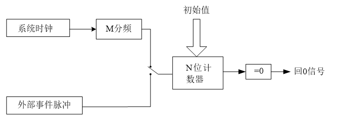

**计数时钟和输出计算**


1）定时器输入时钟频率 $f _{Tclk}$ （即计数时钟频率） ：
$$
f _{Tclk}=\frac{f_{pclk}}{Prescaler+1} \times 分频值
$$
 式中：$Prescaler$，预分频值，$0-255$；分频值为 $1/2,1/4,1/8,1/16$。

2 ）PWM 输出时钟频率 ：

PWM 输出时钟频率 = $f _{Tclk} ∕ TCNTBn$

3）PWM 输出信号占空比（即高电平持续时间所占信号周期的比例）：

PWM 输出信号占空比 = $TCMPBn ∕TCNTBn$


TCNTBn --- Timern 计数初值寄存器（计数缓冲寄存器），16位

TCMPBn---Timern 比较寄存器（比较缓冲寄存器），16位


## 相关寄存器

【TCFG0---预分频器配置寄存器】


Dead zone length 死区宽度设置位
		其值N为： 0~255，以timer0的定时时间为单位
		死区宽度为：（N+1）× timer0 的定时时间
Prescaler1---timer2、3、4的预分频值
		其值N为： 0~255
		输出频率为：PCLK ÷（N+1）
Prescaler0--- timer0、1的预分频值
		其值N为： 0~255
		输出频率为：PCLK ÷（N+1）

【TCFG1---DMA模式与分频选择寄存器】


DMA mode---DMA通道选择设置位
		0000：不使用DMA方式，所有通道都用中断方式
		0001：选择timer0		0010：选择timer1
		0011：选择timer2		0100：选择timer3
		0101：选择timer4		011X：保留
MUX4~MUX0---timer4~timer0 分频值选择

​		0000：1/2			0001：1/4		0010：1/8 			0011：1/16
​		01XX：选择外部TCLK0、1（对timer0、1是选TCLK0，对timer4、3、2是选TCLK1）

【TCON---定时器控制寄存器】


TL4~TL0---计数初值自动重装控制位
	    0：单次计数
		1：计数器值减到0时，自动重新装入初值连续计数。
TUP4~TUP0---计数初值手动装载控制位。
		0：不操作			1：立即将TCNTBn中的计数初值装载到计数寄存器TCNTn中。
		说明：如果没有执行手动装载初值，则计数器启动时无初值。

TR4~TR0---TIMER4~TIMER0运行控制位
		0：停止		1：启动对应的TIMER
TO3~TO0--- TIMER4~TIMER0输出控制位
		0：正相输出		1：反相输出
DZE---TIMER0死区操作控制位
		0：禁止死区操作	1：使能死区操作

```c
void __irq Timer0Handler(void)
{
    rSRCPND = BIT_TIMER0; // Clear pending bit
    rINTPND = BIT_TIMER0; // Clear serve bit
    
    // 其他逻辑
}

void Init_Timer0(void){
    //注册响应函数
    pISR_TIMER0 = (int)Timer0Handler;
    
    //开中断, 如果有多个
    rINTMSK = ~(BIT_TIMER1 | BIT_TIMER0);
    
    // 设置预分频寄存器
    rTCFG0 = 0x00000f0f; // 死区宽度=0, T1预分频=0x0f, T0预分频=0x0f
    rTCFG1 = 0x00001233; // T4---T0分频值为：1/2, 1/4, 1/8, 1/16, 1/16
    
    // 设置计数值
    rTCNTB0 = 0xffff; // 计数65535 次
    
    // 设置比较计数器
    rTCMPB0 = 0x00;   
    
    // 设置 TCON
    rTCON = 0x006aaa0a; // 自动重装,立即装载,停止,正相, 禁止死区
    rTCON = 0x00599909; // 自动重装,不立即装载,启动,正相, 禁止死区
}
```


## PWM 应用

直流电机的速度控制中，需要对控制信号进行功率驱动或电气隔离，以下为典型应用电路（负载为直流电机M1）。

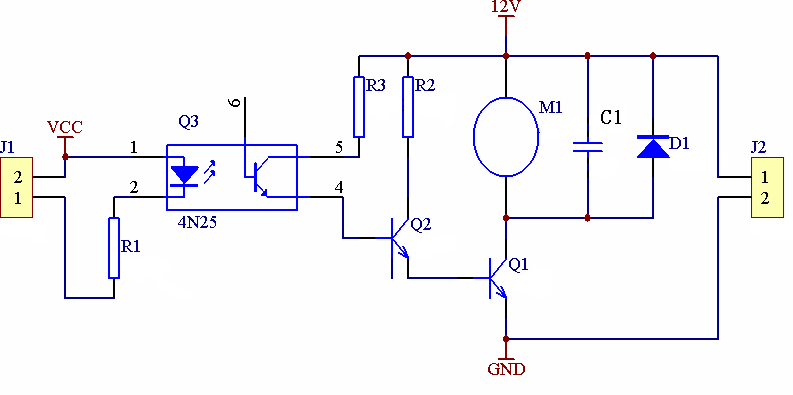

在智能小车的硬件电路基础上，利用单片机的PWM功能实现小车的转弯功能（左转和右转）,下图为小车电机驱动电路原理。

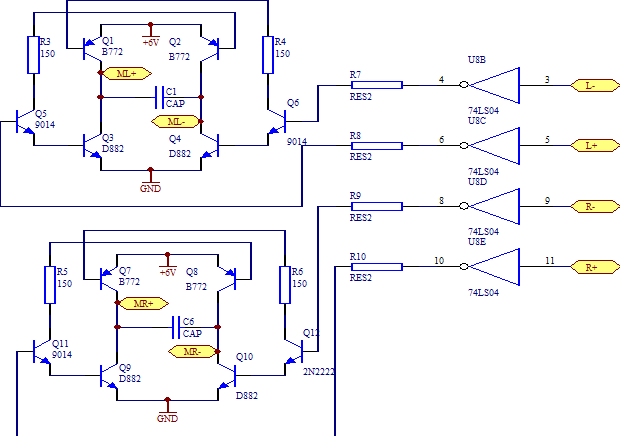


硬件电路分析：
当左侧电机需要前进时，L-端保持为“1”，电机的转动速度由L+端的占空比决定;
当左侧电机需要后退时，L+端保持为“1”，电机的转动速度由L-端的占空比决定；
当右侧电机需要前进时，R-端保持为“1”，电机的转动速度由R+端的占空比决定;
当右侧电机需要后退时，R+端保持为“1”，电机的转动速度由R-端的占空比决定。
软件思路：
智能小车左转的条件：左侧电机反转，同时右侧电机正转。
智能小车右转的条件：右侧电机反转，同时左侧电机正转。
智能小车加速的条件：减少PWM脉冲的占空比。
智能小车减速的条件：增加PWM脉冲的占空比。
单片机I/O口分配
左侧电机前进PWM控制信号:		P1.7
左侧电机后退PWM控制信号:		P1.6
右侧电机前进PWM控制信号:		P1.5
右侧电机后退PWM控制信号:		P1.4

## S3C2410 看门狗结构与工作原理

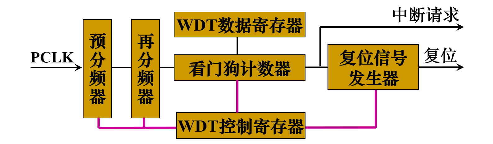


预分频器为8位，其值为：0---255
再分频器可选择值为：16、32、64、128
$$
f_{wtd}=\frac{PCLK}{(Prescaler+1)\times Factor}
$$
看门狗的定时周期为：
$$
T=WTDAT×\frac{1}{f_{wdt}}
$$

## 看门狗控制寄存器(WTCON)

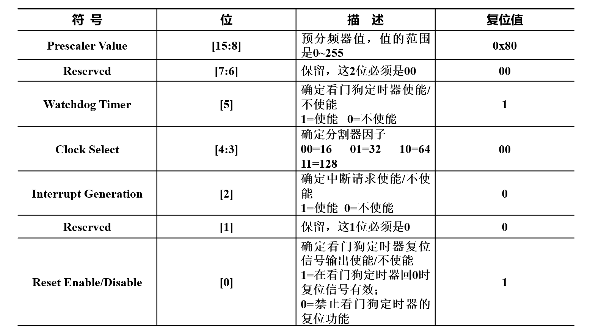

例：`WTCON=0b 00011000 00 0 00 1 0 0 = 0x1804`

含义：预分频值为0x18、保留00、先禁止看门狗定时器工作、选择再分频00（分频值为16）、允许定时器中断、保留0、禁止看门狗复位。 

```c
void Init_WT()
{
    rWTCON = 0x1804;
    rWTDTA = 0x8000;
    rWTCNT = 0x8000;
    rWTCON |= 1 << 5;
}
```


## 【看门狗案例】

设S3C2410的PCLK为50MHz，编写一程序，利用 S3C2410 看门狗中断产生频率为1kHz的方波，并且从GPB0引脚输出。

```c
BIT_WDT EQU(0x1 << 9)
#include <string.h>
#include "2410addr.h"
#include "2410lib.h"
#include "timer.h"

void _irq Wdt_Int(void)
{
    rGPBDATA ^ = 0x01;   //对GPB0取反
    rSRCPND | = BIT_WDT; //清除看门狗中断请求标志
    rINTPND | = BIT_WDT; //清除看门狗中断服务标志
}

void Test_WDT_IntReq(void)
{
    Uart_Printf("WatchDog Timer Interrupt Request Test!\n");
    rINTMSK &= ~(BIT_WDT);                   //开看门狗中断
    pISR_WDT = (unsigned)Wdt_Int;            //设置中断向量
    rGPBCON = (rGPBCON | 0x03) & 0xfffffffd; //把GPB0设为输出
    rWTCON = 0x1804;                         //写控制寄存器
    rWTDAT = 60;                             //写数据寄存器
    rWTCNT = 60;                             //写计数器
    rWTCON = rWTCON | (1 << 5);              //看门狗定时器使能(启动WTD)
    Uart_Printf(“Press any Key to Exit !\n”);
    Uart_Getch();          //等待按键
    rWTCON & = ~(1 << 5);  //关闭看门狗定时器
    rINTMSK | = (BIT_WDT); //屏蔽看门狗中断
}
```


## RTC

n实时时钟部件RTC是用于提供年、月、日、时、分、秒、星期等实时时间信息的定时部件。它通常在系统电源关闭后，由后备电池供电。

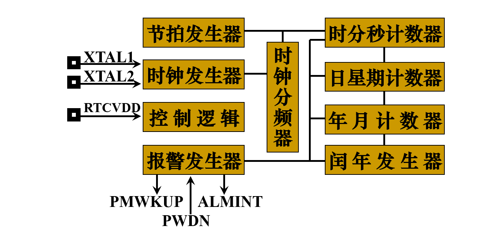

S3C2410 RTC使用方法
（1）设置允许读写：对寄存器RTCCON 的 0 位写1 。
（2）显示时间、日期方法：需要不断地从BCDSEC、BCDMIN、BCDHOUR、BCDDAY、BCDDATE、BCDMON、和BCDYEAR 寄存器读取数据，然后显示出来。  


【RTC 节拍用于中断请求】
TICNT 寄存器：有中断使能位、节拍时间位。
当节拍计数值到达 0 时，就会触发节拍中断。节拍中断的间隔时间计算如下：
$$
Period=(n+1)/128 (秒)
$$
n ：节拍时间计数值（1~127）

【例】编写一程序，对S3C2410的RTC进行设置，使用节拍中断，每1秒中断一次，中断后显示出当前的日期和时间。初始日期、时间设置为正确值。
解：
1、设置控制寄存器:  `RTCCON=0x0 0 0 1 = 0x01`
含义：RTC不复位、正常BCD计数、BCD时钟选择为1/32768、允许读出RTC值

2、设置节拍时间寄存器：`TICNT=0x1 1 1 1 1 1 1 1 = 0xFF`
含义：允许节拍中断、节拍计数值为127，每1秒钟中断一次。

```c
#include "2410addr.h"
#include "2410lib.h"

void Init_Rtc_Tick(void);
void __irq Rtc_Tick(void);

void Init_Rtc_Tick(void)
{

    pISR_TICK = (unsigned)Rtc_Tick; //设置中断服务程序地址
    rINTMSK & = ~(BIT_TICK);        // 开时钟节拍中断

    //设置日期与时间
    rBCDYEAR = 0x07;
    rBCDMON = 0x05;
    rBCDDAY = 0x03; // SUN:1 MON:2 TUE:3 WED:4 THU:5 FRI:6 SAT:7
    rBCDDATE = 0x22;
    rBCDHOUR = 0x08;
    rBCDMIN = 0x38;
    rBCDSEC = 0x25;
    rTICNT = 0xff; //设置节拍值=127

    rRTCCON = 0x01; //启动计时、允许读写

    Uart_Printf("Press any key to exit.\n");
    Uart_Getch(); //等待按键

    rINTMSK |= BIT_TICK; //(1<<8)，关闭时钟节拍中断
}

void __irq Rtc_Tick(void)
{
    char year, month, date, hour, min, sec; //读取年月日
    year = rBCDYEAR;
    month = rBCDMON & 0x1F;
    date = rBCDDATE & 0x3F;
    //读取时分秒
    hour = rBCDHOUR & 0x3F;
    min = rBCDMIN & 0x7F;
    sec = rBCDSEC & 0x7F;
    //显示日期、时间
    Uart_Printf("20 %2x年 %2x月 %2x日, %2x: %2x: %2x\n", year, month, date, hour, min, sec);

    //清除中断请求标志
    rSRCPND |= BIT_TICK;
    //清除中断请求标志
    rINTPND |= BIT_TICK;
}
```


# S3C2410电源管理模式

S3C2410有4种电源管理模式 :
空闲模式
正常模式
低速模式 
休眠模式 

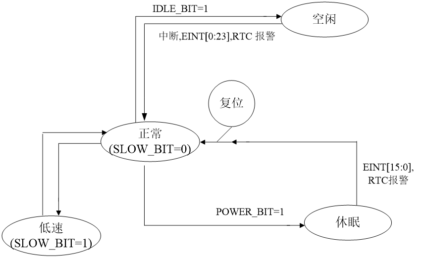


## 时钟控制寄存器(CLKCON) 

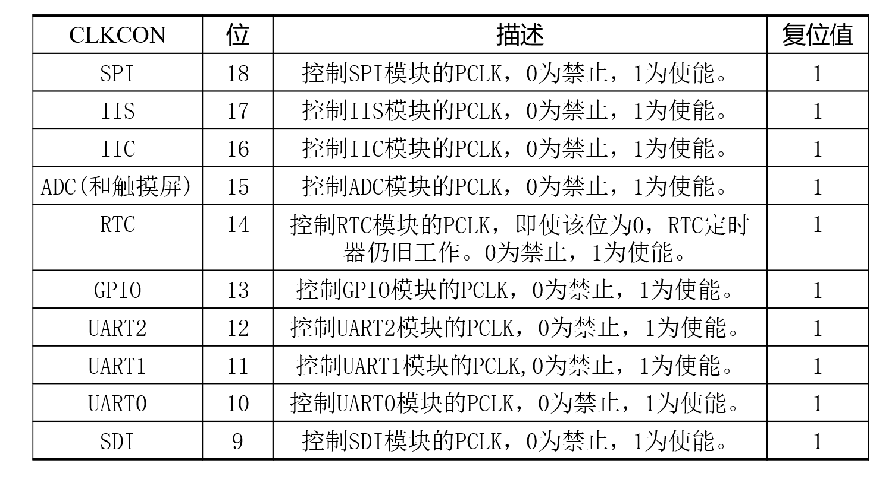

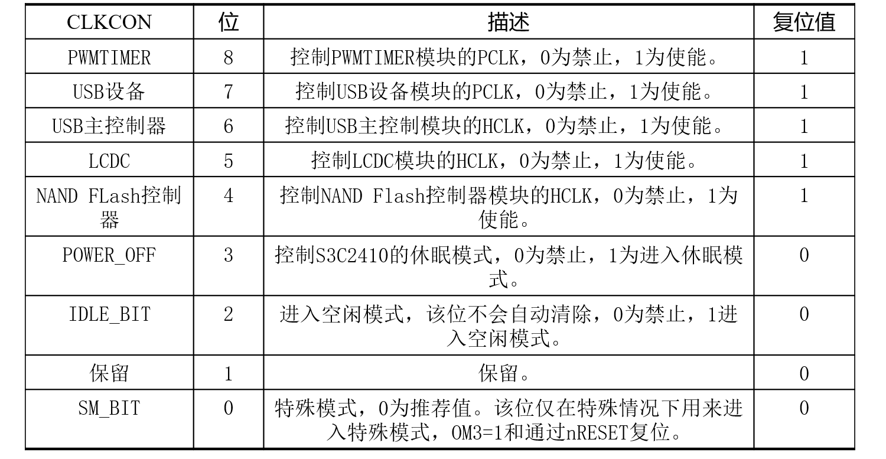


