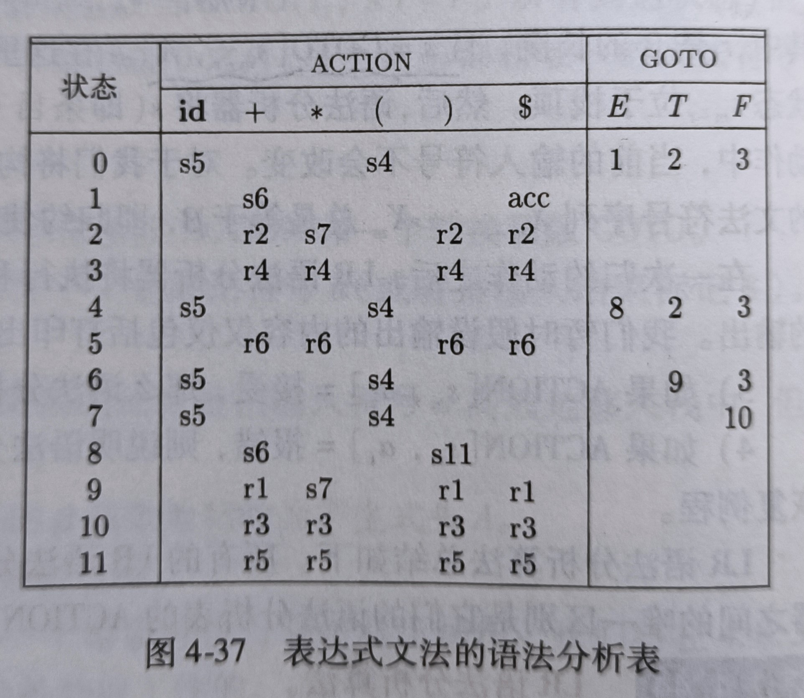
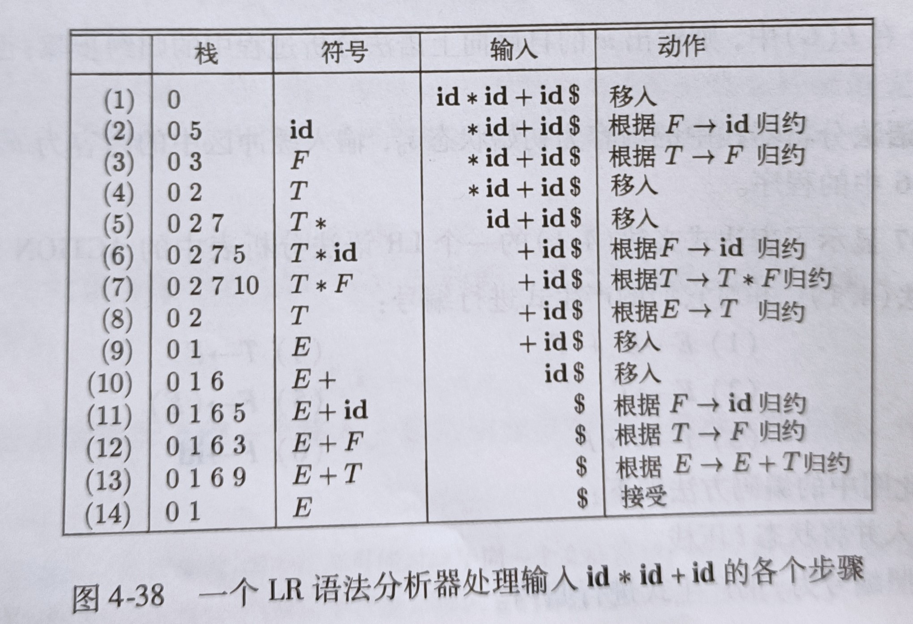
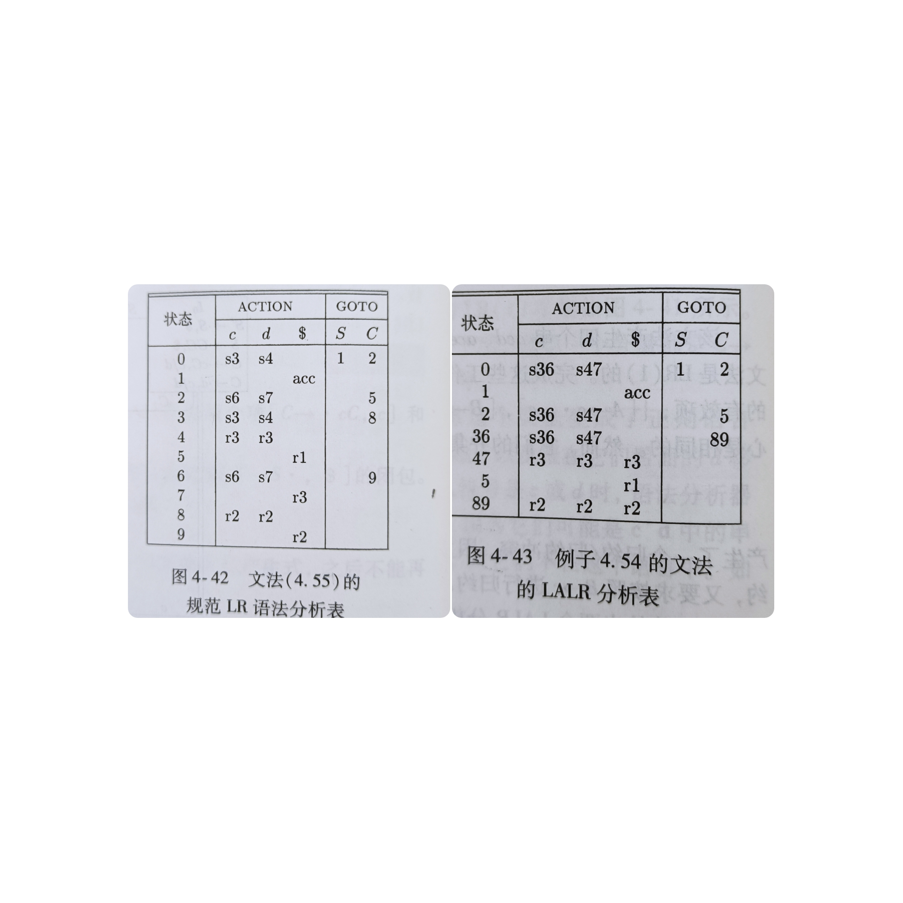

# 基本概念

## 符号和串

**字母表**：一门语言由基本的符号组成，对于某个语言来说，基本元素集合构成了它的字母表。

**符号串**：由字母表中符号组成的有穷符号序列。

【例】

（1）$x=0011$ 是字母表 $\Sigma =\{0,1\}$ 的一个串。

（2）串 $x$ 的长度表示符号的个数，记为 $|x|$ 。

（3）空串一般用 $\varepsilon$ 表示，长度为0。

两个符号串可以拼接在一起：$x=0011,y=1100$，则 $xy=00111100$。

符号串的 $n$ 次幂就是把自己拼接 $n$ 次，即：$x^0=\varepsilon,x^1=x, x^2=xx,\dots, x^n=xx^{n-1}$ 。


**符号串集合**：就是一个字母表上某些符号串的集合。两个符号串的乘积 $AB=\{xy|x\in A, y\in B\}$

用 $\Sigma^*$ 表示字母表上所有有穷符号串的集合。

【例】

设 $\Sigma =\{0,1\}，\Sigma^*=\{\varepsilon, 1, 0, 00,01,10,11,\dots\}$。还可以写成：
$$
\Sigma^*=\Sigma^0\cup\Sigma^1\cup\Sigma^2\cup\dots \cup\Sigma^n\dots
$$
$\Sigma^*$ 称为 $\Sigma$ 的闭包，$\Sigma^+ = \Sigma^1\cup\Sigma^2\cup\dots \cup\Sigma^n\dots$ 称为正闭包。


# 文法与语言

**产生式**：每个产生式定义为一个序偶 $(x,y)$，写作 $x::=y$ 或$x \to y$ ，读作“定义为”。

【例】

$ digits \to 0|1|2|3|4|5|6|7|8|9 $。


一个文法 $G=(V_N,V_T,P,S)$，其中：

- $V_N$ 为非终结符集合；
- $V_T$ 为终结符集合；
- $P$ 为产生式集合；
- $S$ 为开始符号。

⚠️ 提示：

为了方便，记 $V=V_N\cup V_T$。

【例】

一个简单的文法 $G[S]$ 定义：
$$
S\to 0S\\
S\to 1|0|\varepsilon
$$
**直接推导**：设有一个文法：$G=(V_N,V_T,P,S)$，$(x,y)\in P$，$v,w \in (V_N\cup V_T)^*$，称 $v y w$ 为 $v x w$ 的直接推导，记为 $v x w \Rightarrow v y w$。

【例】

设 $x=0S1, y=001$，则利用产生式 $S\to0$ ，得出 $x\Rightarrow y$。

如下推导序列:
$$
x\Rightarrow y_0\Rightarrow y_1\Rightarrow \dots \Rightarrow y_n = y
$$
称为 $x$ 推导出 $y$ ，记为 $x \overset{*}{\Rightarrow} y$，如果 $n>0$，记为 $x \overset{+}{\Rightarrow} y$。

**句型**：给定一个文法：$G=(V_N,V_T,P,S)$，如果 $S \overset{*}{\Rightarrow} x$，则称 $a$ 为 $G$ 的一个句型，如果 $x$ 只包含终结符号，则称 $x$ 为 $G[S]$ 的句子。

**语言**：文法 $G$ 描述的语言就是该文法所有句子的集合，记为 $L(G)$， 即 $ L(G)=\{x|S \overset{*}{\Rightarrow} x, x\in V^*_T\}$。

**最左直接推导**：替换最左边的非终结符。即 $v A\delta \Rightarrow v \beta\delta$，其中 $v\in V_T^*$，$A\in V_N$，$\beta,\delta \in (V_N\cup V_T)^*$，$(A,\beta)\in P$，则称 $v \beta\delta$ 是 $v A \delta$ 的一个最左直接推导。


## 文法分类

- 0 型文法（短语文法）：产生式 $x\to y$ 满足：$x\in (V_N\cup V_T)^*$ ，并且 $x$ 包含非终结符号，$y\in (V_N\cup V_T)^*$
- 1 型文法 （上下文相关文法）：产生式 $x\to y$ 满足： $|y|\ge |x|$。
- 2 型文法 （上下文无关文法）：产生式 $x\to y$ 满足： $x$ 是一个非终结符号，$y\in (V_N\cup V_T)^*$。
- 3 型文法（正则文法）：产生式的形式都是：$A\to aB$ 或 $A\to a$，其中 $A,B$ 是非终结符，$a\in V_T^*$，这种产生式不会使非终结符增多。


## 语法树

定义：给定上下文无关文法 $G=(V_N,V_T,P,S)$，

- 树中每一个节点都有一个标记 $a, a\in V_N\cup V_T$，
- 叶子节点表示终结符号，
- 根节点表示起始符号 $S$
- 如果有产生式：$A\to A_1A_2\dots A_n$，那么 $A_1,A_2,\dots,A_n$ 是 $A$ 的子节点。


【例】设有如下文法 $G[E]$：

$ E \to E + T | T$

$T\to T*F|F$

$F\to (E) | i$


## 正则表达式

设字母表为 $\Sigma$ ，正则表达式和正则集递归定义如下：

（1）$\varepsilon$ 和 $\varnothing$ 都是 $\Sigma$ 上的正则表达式，它们表示的正则集为 $\{ \varepsilon\}, \varnothing$。

（2）任何 $a\in \Sigma$，$a$ 是 $\Sigma$ 上的一个正则表达式，它表示的正则集为 $\{ a \}$ 。

（3）若 $e_1, e_2$ 都是 $\Sigma$ 上的正则表达式，它们表示的正则集为 $L(e_1), L(e_2)$，那么 $(e_1), e_1|e_2, e_1\cdot e_2, e_1^*$ 都是正则表达式，它们对应的正则集为 $L(e_1), L(e_1)\cup L(e_2), L(e_1)L(e_2), (L(e_1))^*$。

（4）只有有限次使用以上三条规则而定义的表达式才是 $\Sigma$ 上的正则表达式，仅由这些正则表达式所表示的符号串集合才是 $\Sigma$ 上的正则集。

📝提示：

符号 $|$ 表示或，$\cdot$ 表示连接，$*$ 表示幂，即自身的有限任意次连接，括号$()$ 表示一个整体。


# 计算理论

有穷自动机，是一种识别装置，能识别某个串是否符合正则文法。分为两类：一类是确定的有穷自动机 (DFA)，另一类是非确定有穷自动机(NFA)。

## 确定的有穷自动机

确定的有穷自动机在数学上用一个五元组表示：
$$
M=(K,\Sigma,f, S,Z)
$$
其中：

（1）$K$ 是自动机的状态集。

（2）$\Sigma$ 是字母表，也称为自动机的输入符号集

（3）$f$ 是转换函数，它根据自动机的当前状态 $k_i$ 和输入字符 $a$ 确定自动机的下一个状态 $k_j$，即 $f(k_i,a)=k_j$，或 $f: K\times \Sigma \to K$。

（4）$S\in K$ ，表示自动机的初始状态。

（5）$Z\subseteq K$ ，表示自动机的接受状态。

自动机可以用如下示意图 ([图片来源](https://zhuanlan.zhihu.com/p/30009083)) 表示：

 

（1）$S_0$ 表示一个初始状态

（2）箭头解释：自动机在 $S_0$ 收到 $0$ 的输入就会转移到状态 $S_1$，收到 1 仍然在状态 $S_0$，其他依次类推。

（3）双圈的状态表示接受态。

该状态机对如下符号串的识别结果如下：

（1）$\varepsilon$ ：不接受

（2）001：接受

（3）000：不接受

（4）0：不接受


##  非确定的有穷自动机

非确定的有穷自动机在数学上用一个五元组表示：
$$
M=(K,\Sigma,f, S,Z)
$$
其中：

（1）$K$ 是自动机的状态集。

（2）$\Sigma$ 是字母表，也称为自动机的输入符号集

（3）$f$ 是转换函数，它的数学表示为：$f: K\times\Sigma^*\to 2^K$，$\Sigma^*$ 表示接受一个输入或不接受输入，$2^K$ 表示 $K$ 的幂集，表示可以跳转到多个状态。

（4）$S\subseteq K$ ，表示自动机的初始状态。

（5）$Z\subseteq K$ ，表示自动机的接受状态。


DFA 与 NFA 的主要区别：

（1）DFA 没有输入空串之上的转换动作；

（2）对于 DFA，一个特定的符号输入，能且只能得到一个状态，而 NFA 就有可能得到一个状态集。


【定理】NFA 可以转换为一个等价的 DFA。

【定理】正则表达式与有穷自动机等价。


## 小结

正则语言三种模型

- 有穷自动机
- 正则表达式
- 正则文法

有穷自动机

- 只有一个状态变量
- 输出只有 T 或 F


# 自顶向下语法分析

语法分析有自顶向下与自底向上两种方法。

自顶向下分析有：

（1）确定的自顶向下分析

（2）不确定的自顶向下分析：多用于理论分析，实际用得少

自底向上分析有：

（1）算符优先分析

（2）LR分析


【例】设有文法 $G[S]$：
$$
\begin{align}
S &\to AB\\
A &\to aA | \varepsilon \\
B &\to b | bB\\
\end{align}
$$
和句子：$aaab$

自顶向下推导过程如下：$S\Rightarrow AB\Rightarrow aAB\Rightarrow aaAB\Rightarrow aaaAB\Rightarrow aaaB \Rightarrow aaab$

自底向上推导过程如下：$aaab \Leftarrow εaaab \Leftarrow Aaaab\Leftarrow Aaab\Leftarrow Aab\Leftarrow Ab \Leftarrow AB \Leftarrow S$

**分析过程的回溯和歧义**

上面的例子其实是一个精心挑选出来的例子，在推导的过程中，每一步恰好有唯一的一个产生式可以应用，即每一步都可以排除掉其他所有的产生式。但在实际分析时，在中间过程中可能会遇到如下两种情况：

（1）所有产生式都不可应用
（2）有多个产生式可以应用


对于第二种情况，需要采用回溯，先试探性的选择一个产生式，若一直推导至最终句子（或起始符号），则表明此产生式是可用的。如果在推导过程中遇到第一种情况，则回溯选择另一个产生式。如果所有产生式都遇到第一种情况，则表明最终句子不符合语法结构。如果此处有多条产生式可以推导至最终句子（或起始符号），则表明语法有歧义。

回溯分析一般都非常慢，因此一般通过精心构造语法来避免回溯。

**分析的局部性约束**

上面的例子中，我们可以看到整个句子 aaab ，所以在挑选产生式时可以利用整个句子的信息，在实际编译过程中，实际的句子（源程序）是一个很长的符号流，分析的每一步中其实只能看到刚刚读入的一到两个符号，后面很长的一串符号都看不到，这种只能根据当前有限个符号做判断的情况就是分析的局部性约束。


🔗 [本例参考链接](https://pandolia.net/tinyc/ch9_context_free_grammar.html)


## 左递归的消除

左递归 (left recursive) 是指形如 $A \to A u$ 这样的规则，$A$ 是一个非终结符。

为避免回溯，不宜将自顶向下分析法应用于含左递归的语法。

## 直接左递归的消除

【例】消除产生式的左递归： $P\to P\alpha |\beta$

【解】改写为：$P\to\beta P', P'\to \alpha P'|\epsilon$

一般形式的直接左递归：$P\to P\alpha_1|\dots|P\alpha_m| \beta_1|\dots|\beta_n$

改写为：

$P\to \beta_1P'|\dots|\beta_nP'$

$P'\to \alpha_1P'| \dots|\alpha_m P'|\epsilon$


## 间接左递归的消除

间接左递归示例：

$S\to Qc|c$

$Q\to Rb|b$

$R\to Sa|a$

间接左递归产生的原因：推导串的某个非终结符存在环路，即存在 $A\overset{+}{\Rightarrow} A\alpha$ 的形式。

消除方法：打破可能存在的环路。


【**间接左递归的消除算法**】

```python 
将非终结符号排序为 A1,A2,...,An

for i in [1..n]:
    for j in [1..i-1]:
        将产生式 Ai ::= Ajβ 中的 Aj 利用 Aj ::= α1 | α2 | ... | αn 替换为
        Ai ::= α1β | α2β |...| αnβ
    消除 Ai 的直接左递归
```

简单理解：

对每个每个非终结符 $A_i$，把它产生式右部的比他小的非终结符从小到大依次替换。

【例】对于开头的示例，排序为 $S, Q, R$

1）$S\to Qc|c$ 不用动，因为右部没有比他小的。

2）$Q\to Rb|b$ 同理

3）$R\to Sa|a$ 先替换 $S$：

4）$R\to Qca|ca|a$，再替换 $Q$：

5）$R\to Rbca| bca|ca|a$，再消除直接左递归：

6）$R\to bcaR'|caR'|aR', R'\to bcaR'|\epsilon$


## LL(1) 算法

1）将符号S\$压入栈中，美元符表示栈底，并在输入串尾部追加 \$ 作为输入结束标记。

2）从左向右读输入符号，重复以下步骤

2.1 如果栈顶元素为终结符，则用与输入符号 a 匹配，匹配成功则弹出一个符号，否则 ERROR

2.2 如果栈顶元素为非终结符A，输入符号为 a，则选择一条能够产生首字符 a 的产生式进行推导，用产生式的右部替换栈中的 A，如果没有产生式则ERROR；如果有两个及以上产生式，表明不是 LL(1) 文法。

2.3 如果栈中 \$ 与输入 \$ 匹配则接受，否则 ERROR


下面所介绍的是：如何选择一条能够产生首字符 a 的产生式进行推导。使用的方法是构造一个预测分析表。

【例】文法
$$
\begin{align}
E &\to E+T | T\\
T&\to T*F|F\\
F&\to (E) | id\\
\end{align}
$$
的预测分析表如下：
|      | id     | +        | \*        | (      | )     | \$    |
| ---- | ------ | -------- | -------- | ------ | ----- | ----- |
| $E$  | $E\to TE'$ |          |          | $E\to TE'$ |       |       |
| $E'$ |        | $E'\to +TE'$ |          |        | $E'\to ε$ | $E'\to ε$ |
| $T$ | $T\to FT'$ |          |          | $T\to FT'$ |       |       |
| $T'$ |        | $T'\to ε$ | $T'\to *FT'$ |        | $T'\to ε$ | $T'\to ε$ |
| $F$  | $F\to id$ |          |          | $F\to (E)$ |       |       |

一、消除左递归：

$E  \to TE'$
$E' \to +TE'| \epsilon$
$T  \to FT' $
$T' \to *FT'| \epsilon$
$F  \to (E) | id$

二、求该文法的 FIRST 集

$FIRST(\alpha)$ 被定义为可从 $\alpha$ 推导得到句子开始终结符号集，即： 
$$
FIRST(\alpha)=\{a| \alpha\overset{*}{\Rightarrow} a\beta, a\in V_T, \alpha,\beta\in V^*\}
$$
如果 $ \alpha\overset{*}{\Rightarrow} ε$，则 $ε \in FIRST(\alpha)$。

💡 如何使用 FIRST 集呢？

对于产生式 $S\to \alpha | \beta$，我们只需查看下一个输入符号 a 就知道该选择哪个产生式，这是因为如果 $a\in FIRST(\alpha)$ 就选择 $S\to \alpha$，如果 $a\in FIRST(\beta)$ 就选择 $S\to \beta$ 。如果 a 在这两个集合中，说明不是 LL(1) 文法；如果都不属于，输入串不是该文法的句子。

⚙️ FIRST 集求解算法

1）如果 $X$ 是终结符号或 $\epsilon$，则 $FIRST(X)=X$

2）如果有产生式 $X\to Y_1 Y_2\dots Y_n$，为了方便记 $Y=Y_1Y_2\dots Y_n$ 将 $FIRSR(Y_1)$ 中的非 $\epsilon$ 符号加入 $FIRST(Y)$，如果 $\epsilon\in FIRST(Y_1)$，则将 $FIRSR(Y_2)$ 中的非 $\epsilon$ 符号加入 $FIRST(Y)$，依次类推。如果 $\epsilon$ 在所有的 $FIRST(Y_i)$ 中，则将它加入 $FIRST(Y)$。

三、求该文法的 FOLLOW 集

对于非终结符号 $A$ ，$FOLLOW(A)$ 被定义为紧跟在 $A$ 后面的终结符号集合，即

$$
FOLLOW(A)=\{a| S\overset{*}{\Rightarrow} \alpha A\beta,A\in V_N, a\in FIRST(\beta), \alpha\in V_T^*, \beta\in V+\}
$$
如果 $ \beta\overset{*}{\Rightarrow} ε$，规定 $\$ \in FOLLOW(A)$，`$` 是一个特殊符号，表示输入结束。

⚙️ FOLLOW 集求解算法

求解 FOLLOW 集时，不断应用如下规则，直到没有新的符号加入：

1）将 \$ 加入到 $FOLLOW(S)$ 中，$S$ 是起始符号。

2）如果存在产生式 $B\to \alpha A \beta$，将 $FIRST(\beta)$ 除去 $\epsilon$ 加入到 $FOLLOW(A)$ 中。

3）如果存在产生式 $B\to \alpha A$ 或  $\epsilon$ 在 $FIRST(\beta)$ 中，则将所有 $FOLLOW(B)$ 加入到 $FOLLOW(A)$ 中。

## 预测分析表构造

⚙️ 预测分析表构造算法

输入：文法 G

输出：预测分析变表 M

方法：对于文法 $G$ 中的每个产生式 $A\to \alpha$ 作如下处理：

1）对于 $FIRST(\alpha)$ 中的每个终结符号 a，将 $A\to \alpha$ 填入 $M[A,a]$ 。

2）如果 $\epsilon$ 在$FIRST(\alpha)$ 中，那么对于 $FOLLOW(A)$ 中的每个终结符号 b（包括 \$），将 $A\to \alpha$ 填入 $M[A,b]$。

3）表 $M$ 中没有产生式的地方表示错误，如果有两条产生式，表示不是 LL(1) 文法。


## 分析算法

设有文法 $G[S]$:
$$
S\to 0S1
$$
与串 $s=0011$。$s$ 是 $G$ 的句子吗？

【算法1】蛮力法

```python
def Parse(X, s):
    if X==s:
        return true
    foreach X=>Y:
        if Parse(Y,s):
            return true
    return false
```

存在的问题：

1. 不完全正确
2. 可能不会停机

【算法2】基于PDA的分析方法

采用最左推导，让输入串与最左终结符匹配。

1. 向栈顶压入 $\$S$，如果栈顶为非终结符 $A$，则非确定性的用 $A$ 的所有产生式的右替换栈顶的A。
2. 如果栈顶的终结符号为a,且与输入串的第一个符号匹配，


先消除左递归：
$$
\begin{align}
E  &\to TE' \\
E' &\to +T| \epsilon\\
T  &\to FT'\\
T' &\to *F| \epsilon\\
F  &\to (E) | i\\
\end{align}
$$

First：
$$
Fisrt(E)=\{c,i\}\\
First(E')=\{+,\epsilon\}\\
Fisrt(T)=\{(, i \}\\
Fisrt(T')=\{*,\epsilon\}\\
Fisrt(F)=\{c,i\}\\
$$

Follow:

$$
Follow(E)=\{\$,)\}\\
Follow(E')=\{\$,)\}\\
Follow(T)=\{+,\$, )\}\\
Follow(T')=\{+,\$,)\}\\
Follow(F)=\{*,+,\$,)\}\\
$$

|      | i      | +        | *        | (      | )     | \$    |
| ---- | ------ | -------- | -------- | ------ | ----- | ----- |
| E    | E->TE' |          |          | E->TE' |       |       |
| E'   |        | E'->+TE' |          |        | E'->ε | E'->ε |
| T    | T->FT' |          |          | T->FT' |       |       |
| T'   |        | T'->ε    | T'->*FT' |        | T'->ε | T'->ε |
| F    | F->i   |          |          | F->(E) |       |       |


## 本节参考资料

- [自己动手写编译器 — 自己动手写编译器 (pandolia.net)](https://pandolia.net/tinyc/index.html)


# 自底向上语法分析

一个自底向上的语法分析过程对应于为一个输入串构造语法分析输的过程，它从叶子结点逐渐向上到达根结点。自底向上语法分析常采用一种“移入-规约”的分析方法。

我们用 \$ 表示输入串的右边（结束标记）与栈底，按照惯例，自底向上的栈顶显示在右侧。“移入-规约” 的分析方法有四个动作：

1）移入 (shift)：将下一个输入串符号移到栈顶。

2）规约 (reduce)：将栈顶的某些符号替换为一个产生式头部。

3）报错 (error)：语法错误。

4）接受 (accept)：规约到起始符号。

本节使用的文法 G 如下：
1）$E\to E+T$
2）$E\to T$
3）$T\to T*F$
4）$T\to F$
5）$F\to (E)$
6）$F\to id$

【例】设有输入串 $id_1 * id_2$ (下标用于区分)，分析过程如下：

| 栈         | 输入          | 动作               |
| ---------- | ------------- | ------------------ |
| $\$$       | $id_1*id_2\$$ | 移入               |
| $\$id_1$   | $*id_2\$$     | 用 $F\to id$ 规约  |
| $\$F$      | $*id_2\$$     | 用 $T\to F$ 规约   |
| $\$T$      | $*id_2\$$     | 移入               |
| $\$T*$     | $id_2\$$      | 移入               |
| $\$T*id_2$ | $\$$          | 用 $F\to id$ 规约  |
| $\$T*F$    | $\$$          | 用 $T\to T*F$ 规约 |
| $\$T$      | $\$$          | 用 $E\to T$ 规约   |
| $\$E$      | $\$$          | 接受               |

💡 自底向上语法分析 (LR) 的目标是反向构造一个最右推导过程：
$$
E\Rightarrow T\Rightarrow T*F \Rightarrow T*id \Rightarrow F*id \Rightarrow id*id
$$
💡 上述过程第四步没有把 $T$ 规约为 $E$，这是因为规约后得到的句型 $E*id_2$ 不是该文法的句型。那怎么才能知道什么时候规约，什么时候该移入呢？

## SLR 分析

### 增广文法

本节使用的文法 G 如下：
1）$E\to E+T$
2）$E\to T$
3）$T\to T*F$
4）$T\to F$
5）$F\to (E)$
6）$F\to id$

它的增广文法 $G'$ 加入了如下产生式：

$E'\to E$

### 使用语法分析表分析示例

SLR 分析需要构造一个语法分析表：



利用该分析表进行规约：



以上两个图片选自《编译原理》（龙书）第160页。

🔑 分析表使用方法如下：

1）规约步骤第一行表示初始化。

2）根据栈顶状态 0 与输入符号 $id$ 查表得 s5，表示将该输入符号移入，并将状态 5 入栈。

3）根据栈顶状态 5 与输入符号 $*$ 查表得 r6，这表示按 6 号产生式规约，弹出状态 5 ，根据栈顶状态 0 与 6 号产生式头部符号 $F$ 查表得状态 3，将其入栈。

4）根据栈顶状态 3 与输入符号 $*$ 查表得 r4，这表示按 4 号产生式规约，弹出状态 3 ，根据栈顶状态 0 与 4 号产生式头部符号 $T$ 查表得状态 2，将其入栈。

5）根据栈顶状态 2 与输入符号 $*$ 查表得 s7，表示将该输入符号移入，并将状态 7 入栈。

6）根据栈顶状态 7 与输入符号 $id$ 查表得 s5，表示将该输入符号移入，并将状态 5 入栈。

依次类推直到接受或检测到错误。

这个语法分析表很好用，那么如何构造这个语法分析表呢？

### 语法分析表构造

分析表中的状态表明了我们在语法分析中所处的状态，分析过程其实是在这些状态之间转移，因此可以构造一台状态机，这台状态机我们叫做 LR(0) 状态机。一个状态是一些**项 (item)** 的集合，简称**项集**。

文法 G 的一个 LR(0) 项是一个产生式加上一个位于产生式体中某个位置的点，例如产生式 $A\to XYZ$ 产生了四个项：

$A\to \cdot XYZ$

$A\to X\cdot YZ$

$A\to XY\cdot Z$

$A\to XYZ\cdot$

特别地 $A\to \epsilon$ 的项为：$A\to \cdot$

项集并不是产生式对应的项的集合，而是由如下两个函数产生的： $CLOSURE,GOTO$。

🧬 【项集的闭包】

如果 $I$ 是文法 $G$ 的一个项集，那么 $CLOSURE(I)$ 由如下步骤生成：

1）用 $J$ 表示 $CLOSURE(I)$，一开始将 $I$ 中的项加入到 $J$。

2）重复如下过程，直到没有新的项加入到 $J$ :

​	从 $J$ 中取出一个产生式 $A\to \alpha \cdot B\beta$，对于所有的 $B\to \gamma$，把 $B\to \cdot\gamma$ 加入到 $J$ 中（不重复加入）。

事实上，项集 $I$ 是它的**内核项**的闭包，所谓的内核项是初始项 $S'\to \cdot S$ 以及点**不在**最左边的项。

🧬 【GOTO 函数】

利用 GOTO 函数可以求的新的项集，或者说，利用 GOTO 函数可以从一个初始状态求得 LR(0) 自动机的所有状态，LR(0) 所有状态也叫项集族 (其实就是项集集，但是这么这么说挺别扭的[doge])。

$I$ 表示一个项集，$X$ 表示一个文法符号，那么 $GOTO(I,X)$ 被定义为 $I$ 中所有形如 $A\to\alpha\cdot X\beta$ 的项所对应的项 $A\to \alpha X\cdot \beta$ 的闭包。

🧬 【项集族求法】

下面介绍的算法就是求项集族的方法：

⚙️ 求解项集族算法

输入：增广文法 $G'$

输出：项集族

方法：

```c
C={CLOSURE({S->.S})};
repeat
    for (C 中每个项集 I)
        for (每个文法符号 X)
            if (GOTO(I,X) 非空且不在 C 中)
                将 GOTO(I,X) 加入 C 中；
until 没有新的项集加入到 C 中；
```


### 语法分析表构造方法

⚙️ 语法分析表构造算法

输入：增广文法 $G'$

输出：语法分析表

ACTION子表构造方法：

1）求出 $G'$ 的项集族 $C=\{I_0, I_1,\dots,I_n\}$，用项集的下标表示状态。

2）对于终结符号 $a$，如果 $A\to \alpha\cdot a\beta$ 在 $I_i$ 中，且 $GOTO(I_i,a)=I_j$，那么把 $s_j$ 填入 $ACTION[i,a]$

3）如果 $A\to \alpha\cdot$ 在 $I_i$ 中且 $A$ 不为 $S'$，那么对于 $FOLLOW(A)$ 中的所有 $a$，将 $ACTION[i,a]$ 设置为规约 $A\to \alpha$。

4）如果 $S'\to S\cdot$ 在 $I_i$ 中，那么将 $ACTION[i,\$]$ 设置为接受。

GOTO子表构造方法：

5）对于非终结符号 $A$，如果有 $GOTO(I_i,A)=I_j$，那么把 $j$ 填入 $GOTO[i,A]$

6）留空的地方都设置为报错。

7）初始状态就是根据 $S'\to \cdot S$ 求闭包得到的项集，一般用 $I_0$ 表示。


事实上，SLR存在一个问题：可能存在“移入，规约”矛盾，即填表的时候同一个位置出现两种结果。那么我们需要更强大的语法分析器解决这个矛盾。


> 只在 Follow(A) 的地方规约。 


## 规范 LR 分析

规范 LR 方法，或者直接称为 LR 方法，它充分利用了向前看符号。为了解决冲突，需要在状态中包含更多的信息，因此把一个状态的项改写成：$[A\to\alpha\cdot \beta, a]$ 的形式，这样项就包含了两个分量，第二分量称作这个项的**向前看符号**，它是终结符或结束标记。上述项称作 LR(1) 项，1代表的是第二个分量长度。


在考察形如 $[A\to \alpha\cdot \beta, a]$ 的项时，如果 $\beta\not= \epsilon$，$a$ 没有任何作用；如果 $\beta=\epsilon$ 时，只有下一个输入符号等于 $a$ 时才按照 $A\to \alpha$ 进行规约。


为了构造出所有的状态，我们需要改进 $CLOSURE, GOTO$ 两个函数。

🧬 【项集的闭包】

如果 $I$ 是增广文法 $G'$ 的一个项集，那么 $CLOSURE(I)$ 由如下算法生成。

1）重复如下步骤直到没有新的项加入到 $I$ :

2）	对 $I$ 中每个项 $[A\to \alpha\cdot B\beta, a]$ ：

3）		对 $G'$ 中的每个产生式 $B\to \gamma$：

4）			对 $FIRST(\beta a)$ 中的每个终结符号 $b$：

5）				将 $[B\to \cdot\gamma,b]$ 加入到集合 $I$ 中。

6）此时的 $I$ 就是初始时刻的闭包。


🧬 【GOTO 函数】

$GOTO(I,X)$ 求法如下：

1）将 $J$ 初始化为空集；

2）对 $I$ 中每个项 $[A\to \alpha\cdot X\beta,a]$:

3）	将项 $[A\to\alpha X\cdot \beta,a]$ 加入到 $J$

4）返回 $CLOSURE(J)$。


🧬 【项集族 $C$ 求解算法】

1）令 $I_0=\{[S'\to S\cdot,\$]\}$ ，将 $CLOSURE(I_0)$ 加入到 $C$。

2）重复如下过程直到没有新的项集加入到 $C$ ：

3）	对 $C$ 中每个项集 $I$:

4）		对每个文法符号 $X$：

5）			如果 $GOTO(I,X)$ 非空且不在 $C$ 中：

6）				将 $GOTO(I,X)$ 加入到 $C$ 中。

7）返回 $C$。


## LR(1) 语法分析表构造算法

输入：一个增广文法 $G'$

输出：$G'$ 的规范 LR 语法分析表

ACTION子表构造方法：

1）求出 $G'$ 的 LR(1) 项集族 $C=\{I_0, I_1,\dots,I_n\}$，并用项集的下标表示状态。

2）对于终结符号 $a$，如果 $[A\to \alpha\cdot a\beta,b]$ 在 $I_i$ 中，且 $GOTO(I_i,a)=I_j$，那么把 $s_j$ 填入 $ACTION[i,a]$

3）如果 $[A\to \alpha\cdot,a]$ 在 $I_i$ 中且 $A$ 不为 $S'$，那么将 $ACTION[i,a]$ 设置为规约 $A\to \alpha$。

4）如果 $[S'\to S\cdot,\$]$ 在 $I_i$ 中，那么将 $ACTION[i,\$]$ 设置为接受。

如果存在冲突，表明这个文法不是 LR(1) 的。

GOTO子表构造方法：

5）对于非终结符号 $A$，如果有 $GOTO(I_i,A)=I_j$，那么把 $j$ 填入 $GOTO[i,A]$。

6）留空的地方都设置为报错。

7）初始状态就是根据 $[S'\to \cdot S,\$]$ 求闭包得到的项集，一般用 $I_0$ 表示。


【例】求解如下增广文法 $G'$ 的项集族：

$S'\to S$

$S\to CC$

$C\to cC|d$

【解】

1）初始状态 $I_0=\{[S'\to \cdot S,\$]\}$ ，需要求它的闭包。对比算法：

此时 $A=S', \alpha=\epsilon,B=S, \beta=\epsilon, a=\$$，而 $FIRST(\beta a) =\{\$\}$ ，因此将 $[S\to\cdot CC,\$]$ 加入 $I_0$

此时 $A=C, \alpha=\epsilon,B=C, \beta=C, a=\$$，而 $FIRST(C \$) =\{c,d\}$ ，因此将 $[C\to\cdot cC,c]，[C\to\cdot cC,d],[C\to\cdot d,c],[C\to\cdot d,d] $ 加入 $I_0$ 。

为了方便 我们把 $I_0$ 表示成如下形式：
$$
\begin{align}
I_0:&S'\to \cdot S,\$\\
&S\to \cdot CC,\$\\
&C\to \cdot cC,c/d\\
&C\to \cdot d,d/d\\
\end{align}
$$
接下来利用 GOTO 函数得到其他项集，令 $X=S$，则 $J=GOTO(I_0,S)=\{S'\to S\cdot,\$\}$，求闭包之后 $J$ 不变。因此：
$$
\begin{align}
I_1:&S'\to S \cdot,\$\\
\end{align}
$$
令 $X=C$，则 $J=GOTO(I_0,C)=\{S\to C\cdot C,\$\}$，求闭包之后得到
$$
\begin{align}
I_2:&S \to C \cdot C,\$\\
&C \to \cdot cC,\$\\
&C \to \cdot d,\$\\
\end{align}
$$
根据项集族求解相关算法，得到：
$$
\begin{align}
I_3:&C \to c \cdot C,c/d\\
&C \to \cdot cC,c/d\\
&C \to \cdot d,c/d\\
\end{align}
$$

$$
\begin{align}
I_4:&C \to d \cdot,c/d\\
\end{align}
$$

$$
\begin{align}
I_5:&S \to CC \cdot,\$\\
\end{align}
$$

$$
\begin{align}
I_6:&C \to c \cdot C,\$\\
&C \to \cdot cC,\$\\
&C \to \cdot d,\$\\
\end{align}
$$

$$
\begin{align}
I_7:&C \to d \cdot,\$\\
\end{align}
$$

$$
\begin{align}
I_8:&C \to cC \cdot,c/d\\
\end{align}
$$

$$
\begin{align}
I_9:&C \to cC \cdot,\$\\
\end{align}
$$


一般来说，LR(1) 的分析表比较庞大，可以合并其中的某些项使之变成 LALR 分析表。上面的例子 36, 47, 89 的第一个分量相同，因此可以将他们合并：
$$
\begin{align}
I_{36}:&C \to c \cdot C,\$/c/d\\
&C \to \cdot cC,\$/c/d\\
&C \to \cdot d,\$/c/d\\
\end{align}
$$

$$
\begin{align}
I_{47}:&C \to d \cdot,\$/c/d\\
\end{align}
$$

$$
\begin{align}
I_{89}:&C \to cC \cdot,\$/c/d\\
\end{align}
$$

状态表如下图所示：



注：上述例子和图表选自龙书第4.7节。

我们可以先构造 LR(1) 分析表，然后通过“合并同类项”的方法，构造出LALR分析表，但是这个过程不是很高效，因此有了如下算法。

## 高效 LALR 分析表构造算法

🚧 正在学习中...


# 语法制导翻译

🧬 属性文法：

1）向文法符号添加一些属性

2）根据产生式定义属性之间约束关系，这种约束关系也称为语义规则。

【例】文法符号 $id$ 可能的属性有 $name, addr, type, value$，可以通过 $id.name$ 这样的方式获取相关属性值。

| 产生式       | 语义规则                    |
| ------------ | --------------------------- |
| $E\to E_1+T$ | $E.value=E_1.value+T.value$ |
| $F\to (E)$   | $F.value=E.value$           |

非终结符的两种属性：

1）综合属性 (synthesized attribute)：通过语法分析树的子结点或自身的属性值定义。

2）继承属性 (inherited attribute)：通过父结点，兄弟结点或自身的属性值定义。


最通用的语法制导翻译的方法是先构造一棵语法分析树。对于属性文法，这棵语法书也称附注语法分析树。很多情况下，可以不用构造出完成的语法分析树，而是边扫描边分析。


🧬 语法制导定义：一条附加翻译动作的产生式，表示语法分析过程中使用该产生式进行归约或推导时则调用翻译子程序 $Action$，一般形式如下：
$$
A\to \alpha\{ Action \}
$$

## 自下而上的继承属性求解

自下而上的继承属性求解基本思路：

- 使用一个同步的语义栈，保存语法分析的符号栈对应的语义值；

- 终结符的语义值由词法分析得到；

- 非终结符的语义值在进栈前必须求出；

- 每当使用一条产生式进行归约的时候，则调用对应的翻译子程序。


### 基本过程求解示例

$$
E \to E1 + T \quad \{ ss[nt].v := ss[top + 2].v + ss[top].v \}
$$

该产生式规约时，利用语义规则计算出新栈顶元素值 $ss[nt].v$，然后弹出 $T,+,E1$，再把 $E$ 入栈。


### 猜测

由于继承属性的依赖项可能不在栈内，所以需要猜测依赖的属性在栈内的位置。

【例】设有如下属性文法 $G$：

$D → TL \quad \{L.t := T.t\}$

$T → int\quad \{T.t := integer\}$

$L → L’, id \quad \{id.t := L.t, L’.t := L.t\}$

$L → id \quad \{id.t := L.t \}$

相关的语法制导定义：

$D → TL $

$T → int \quad \{ \$\$.t := integer; \}$

$L → L’, id \quad \{ EnterSymbol( \$3.text, \$0.t ); \}$

$L → id \quad \{ EnterSymbol( \$1.text, \$0.t ); \}$


### 重构文法

有的时候，根据文法无法猜测依赖项在栈中的位置，这时需要修改属性文法，使得依赖属性的位置能够被猜测到。 

【例】

$S → aBC  \quad  \{C.i := B.s\}$

$S → aBAC \quad  \{ C.i := B.s\}$

$C → c \quad  \{ C.s := f( C.i )\}$

$C.i$ 所依赖的属性 $B.s$ 无法在 $c$ 归约到 $C$ 时猜测，所以需要修改文法。

$S → aBC \quad  \{C.i := B.s\}$

$S → aBAMC \quad  \{C.i := M.s M.i := B.s\}$

$C → c \quad  \{C.s := f( C.i )\}$

$M → ε \quad  \{M.s := M.i\}$

$M.i$ 与 $C.i$ 都可以通过猜测的方式求出。


【例】将继承属性改为综合属性 (pascal 语言变量声明)：

$D → L: T$

$T → integer | char$

$L → L, id | id$

可以修改为：

$D → id L$

$L → , id L | : T$

$T → integer | char$


## 基于递归下降分析方法的语义求值

- 函数A的参数是非终结符A的继承属性
- 函数A的返回值中包括A的综合属性
- 在函数A的处理过程中：

	- 决定采用哪条产生式进行推导
	- 在局部变量中保存计算的中间结果
	- 在采用产生式推导的时候，确保传递正确的参数


# 中间代码生成

## DAG 表示

构造DAG结点的值编码方法


输入：op 标号，结点 m，结点 n

输出：数组中具有三元组<op, m,n> 形式的结点的值编码

方法：在数组中搜索编号为 op，左节点为 m, 右节点为 n 的结点 M，如果存在就返回它的值编码。如果不存在，就添加一个新节点 N<op, m, n>，并返回对应值结点。


改进：由于每次都要搜索整个数组，这个开销不小，因此利用哈希表存储，它的键值为 $h(op,m,n)$ ，值为结点 $N<op,l,r>$。

## 三地址代码

形式：x= y op z

【两个基本概念】

地址：名字，常量，编译器生成的临时变量

指令：常见的三地址指令

1）x=y op z 双目运算符

2）x= op y 单目运算符

3）x=y 复制

4）无条件跳转：goto L

5）if x goto L，if False x goto L

6）if x relop y goto L

7）函数调用：

param x1

param x2

...

param xn

y= call p, n

return y

8）y=x[i]，x[i]=y，数组操作

9）`x=&y`，`x=*y`,`x*=y`，地址操作


## 四元数

四个字段：op，arg1，arg2，result


布尔表达式的短路翻译方法

- 当布尔表达式用于控制流语句(if-else, while)的时候，布尔运算符 &&, ||, !被翻译为跳转语句；


## while 语句翻译

While语句的翻译：while E do S

- 生成新标号：`_while@1,_while@2` 和 `_S@1`；

- 将 `_while@2` 赋给 `E.fentry`，将 `_S@1` 赋给 `E.tentry`；

- 依次生成一下代码：

```assembly
_while@1:
	E
_S@1:
	S
	jmp _while@1
_while@2:
```


