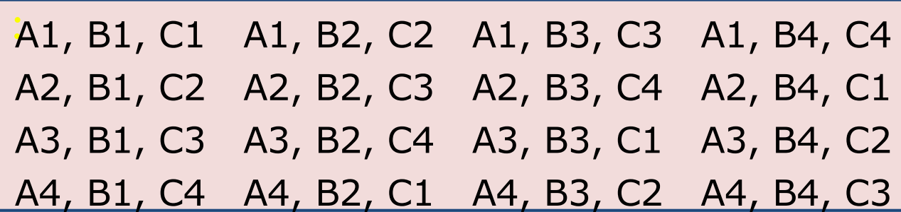

# 基本概念

**错误(error)**:人是会出错的。错误的同义词是过失(mistake)。编程时出的错我们之为bug。错误很容易传递和放大，比如需求分析时出的错在系统设计时有可能会被放大,而且在编码时还会被进一步放大。

**故障( fault)**:故障是错误的后果。更确切地说，故障是错误的具体表现形式，比如文字叙述、统一建模语言(UML)图表、层次结构图、源代码等。类似于把编程错误称为bug，故障的一个很好的同义词是缺陷( defect)(见ISTQB术语表)。故障可能难以捕获。比如一个遗漏错误所导致的故障可能只是在表象上丢掉了一些应有的内容。这里给我们的启发是有必要把故障进一步细分为过失故障和遗漏故障。如果在表象中添加了不正确的信息，这是过失故障;而未输入正确的信息，则是遗漏故在这两类故障中，遗漏故障更难检测和纠正。

**失效( failure)**:代码执行时发生故障就会导致失效。失效具有两个很微妙的特1)失效只出现在程序的可执行表象中，通常是源代码，确切地说是加载后的目标码;2）这样定义的失效只和过失故障有关。那么如何处理遗漏故障所对应的失呢?进一步说，对于不轻易被执行的故障，或者长期不执行的故障，情况又会怎样呢?实施代码审查(见第22章)能够找出故障来避免失效。实际上，好的代码审查同样能检查出遗漏故障。

**事故（incident)**:当失效发生时，用户(或客户，测试人员）可能明显察觉到,也能察觉不到。事故是与失效相关联的症状，它警示用户有失效发生了。

**测试(test)**:测试显然要考虑到错误、故障、失效和事故等诸多问题。测试就是利用测试用例来试验软件。测试有两个明确的目标:找出失效和证实软件执行的正确性。

**测试用例(test case)**:每个测试用例都有一个用例标识，并针对一项程序行为。每个测试用例还包括一组输入和期望输出。

## 理解测试

从本质上讲，测试关心的是软件的行为，而软件行为同软件(或系统)开发人员所常用的面向程序代码的视角并没有直接关系。此处最明显的差别在于:代码侧重于“软件是什么”，而行为则关注“软件干什么”。一直困扰测试人员的一个难点问题是:基础性的文档通常都是由开发人员编写，并且为开发人员服务的，所以这些文档就很自然地强调程序代码方面的信息而不是软件行为的信息。

对测试的一个很好的认识是:测试就是要确定按规定实现的程序行为到底有多少。(需要补充的是,正确性仅仅是针对确定的规格说明和具体的程序实现而言的。正确性是相对的,而不是绝对的。)

构造测试用例有两种基本方法，传统上称为功能测试和结构测试。但用基于规格说明的测试和基于代码的测试则能表述得更确切些，所以本书将采用这两个名称。每种方法都有几种不同的测试用例构造方法，通常也称为测试方法。就方法体系而言，两个测试人员采用相同方法设计出的测试用例应该是相似的(等效的)。

## 基于规格说明的测试

基于规格说明的测试俗称黑盒测试。

对基于规格说明的测试来说，构造测试用例时唯一可用的信息是软件规格说明书。因此,基于规格说明的测试用例有两个突出的优点:1)测试用例与软件的其体实现力的宏并所以即使实现方式发生改变，测试用例仍然有用;2）测试用例的开发可以同软件的实现并行开展，这样可以缩短整个项目的开发周期。不利的方面是，基于规格说明的测试用例常常存在两个问题:测试用例之间会存在严重的冗余，而且还可能有测试不到的地方。

## 基于代码的测试

基于代码的测试是另一种基本的测试用例构造方法。与黑盒测试相对，这种方法有时也被称为白盒(甚至透明盒)测试。透明盒的说法也可能更为恰当，因为这两者最根本的区别在于黑盒中的具体实现目前是已知的并被用于构造测试用例。

## 两种方法比较

这两种方法的根本出发点都是要构造测试用例。基于规格说明的测试方法只利用规格说明来构造测试用例,而基于代码的测试方法则把程序源代码(具体实现）作为构造的依据。后面的章节将说明:单独使用任何一种方法都是不够全面的。从程序行为来看:即使所有的规定行为都没有实现,基于代码的测试用例也发现不了这个问题。反过来也是如此，如果程序实现了未规定行为,基于规格说明的测试用例也发现不了。(木马病毒就是此种未规定行为的例证。)结论是这两种测试方法都必不可少。

## 测试的层次

# 三个测试问题

这3个程序分别是：

- 三角形问题(软件测试界的经典问题)，
- 复杂逻辑函数——NextDate问题(给出第二天的日期),
- 以及一个典型的管理信息系统应用问题——佣金问题。

将这3个程序结合在一起, 可以呈现出单元层次上软件测试所能遇到的绝大多数问题。

## 三角形问题

### 初级版本

三角形程序将接受三个整数输入a、b和c，分别代表三角形的三条边。程序输出为这三条边所构成的三角形的类型，即等边三角形（Equilateral)、等腰三角形(Isosceles)、一般三角形(Scalene）或非三角形四类(NotATriangle)。

###  升级版本

三角形程序将接受三个整数输人a、b和 c，分别代表三角形的三条边。整数a、b和c应满足以下条件:
$$
c_1.\; 1\le a\le 200\\
c_2.\; 1\le b\le 200\\
c_3.\; 1\le c\le 200\\
c_4.\; a<b+c\\
c_5.\; b<a+c\\
c_6.\; c<a+b\\
$$

程序的输出是根据三条边所确定的三角形类型:等边三角形(Equilateral)、等腰三角形(Isosceles)、一双一n2这三个条件中的任何一个，程序将会的取值不在允许范围之内)。如值不能满足c1、 c2或c3这三个条件中的任何一个，程序将会输出一条消息来提示例如:“Value of b is not in the range of permitted values”(b的取值不在允许范围之内)。如果a、b 和c的取值均能满足条件c1、c2和 c3，程序给出以下4种结论之一:

(1）如果三条边全部相同，程序输出结果为等边三角形。

(2）如果恰好有一对边相同，程序输出结果为等腰三角形。

( 3）如果不存在相等的取值，程序输出结果为一般三角形。

(4）如果条件c4、c5和 c6中存在不能满足的情况，程序输出结果为非三角形。

## Next Date 问题

NextDate是一个拥有month、date和year三个输入变量的函数，给出输人日期后面一天的日期。显然变量month、date和 year 均取整数值，并且应满足如下条件(年份范围结束在2012年是任意选取的,并且是来自第一版):
$$
c_1.\; 1\le month\le 12\\
c_2.\; 1\le day\le 31\\
c_3.\; 1982\le month\le 2012\\
$$
如果条件c1、c2或c3中有任意一条不满足，则NextDate 函数应该给出一条输出来提示相应变量的取值不在允许范围内。例如，“Value of month not inthe range 1..12”。由于存在许多无效的日-月-年的组合，NextDate函数根据所有此类情况合并为一个提示信息:“Invalid Input Date”。

NextDate函数之所以复杂有两个原因:一是前面讨论过的输人域复杂性，二是判断某一年是否为闰年的判别规则的复杂性。每一年实际上有365.2422天，因此要设立闰年来解决这个“多余天数”的问题。闰年判别方法是：如果年份数值可以被4整除，并且不是整世纪年，则该年为闰年;世纪年只有是400的倍数时才为闰年(Inglis，1961)。

## 佣金问题

第三个实例佣金问题是典型的商务计算问题，其中包含了计算和决策等步骤可以引申出许多重要的测试问题。这个例子的主要用途是讨论数据流和基于切片的测试。

### 问题描述

从前有一位销售人员在亚利桑那州代销密苏里军械制造厂生产的步枪配件包括枪机( lock)、枪托 ( stock)和枪管( barrel)。枪机售价45美元，枪托售价30美元，枪管售价25美元。销售人员每个月至少要卖出一个枪机，一个枪托和一个枪管（但是没有必要是一支完整的步枪)，而制造厂的生产能力限制销售人员一个月最多只能卖出70个枪机、80个枪托和90个枪管。每走访过一个城镇之后，销售人员都要给密苏里军械厂发一封电报汇报在这一城镇中销售枪机、枪托和枪管的数量。销售人员月末会再发一封很短的电报通知“-1个枪机售出”。这样军械厂就知道当月的销售活动已经结束了，计算销售人员应得的佣金了。

佣金计算方法如下:销售总额1000美元以下(含1000美元)部分的佣金为10%，1000至1800美元之间部分的佣金为15%，超过1800美元的部分的佣金为20%。

# 数学基础

## 集合划分

给定集合 $A$ 和一组 $A$ 的子集 $A_1, A_1,\cdots,A_n$，当且仅当 $A_1 \cup A_2 \cup \cdots \cup A_n=A$，且 $i\not =j \Rightarrow A_i \cap A_j=\varnothing$ 时，称这些子集是 $A$ 的一个划分。

# 边界值测试

我们知道**函数**把一个集合(定义域)中的值映射到另一个集合(值域)中的值上，定义域和值域也可以是其他集合的叉积。从某种意义上来说，如果把程序输入看成定义域，把程序输出看成值域，那么任何程序都可以看作函数。本章和后面两章将研究如和利用程序的这种函数属性来构造测试用例。**程序输入域测试**(也叫边界值测试)是最常用的功能测试技术。长期以来，此类测试技术都把重点放在输入域上，但是很多技术同样可以用在输出域上，以构造基于值域的测试用例。

关于应用程序输入域测试分别有两个问题:第一个问题是我们是否应当考虑变量的无效值，边界值分析仅仅关心输入变量的有效值，稳健性测试则既考虑变量的有效值，又考虑无效值;第二个问题是我们是否要同可靠性理论一样做出单故障（single fault)假设，单故障假设假定故障是由于单个变量的错误值引起的，如果没有这一假设，就意味着我们要考虑到两个或两个以上的变量间的相互影响，也就要用到个别变量的叉积。结合到一起，这两个问题产生了四种不同的边界值测试:

- 边界值分析(normal boundary value testing)

- 健壮性测试(robust boundary value testing)

- 最坏情况测试(worst-case boundary value testing)

- 健壮最坏情况测试(robust worst-case boundary value testing)

## 边界值分析

边界值测试的基本思想是:错误通常出现在输入变量的极值附近。

边界值分析技术的基本思想是利用输人变量的最小值min、略大于最小值的值min+、正常值nom、略小于最大值的值max-和最大值处的取值max。

边界值分析的另一个要点基于一个十分重要的假设,这个假设在可靠性理论中被称作“单故障”假设，即失效问题通常不会由两个(或多个)故障同时引发。全对(all pairs)测试方法与该假设是冲突的,全对测试方法基于对软件控制的医疗系统的观察,发现在这一系统中几乎全部的故障都是由变量对之间的交互导致的。

因此,构造边界值测试用例的方法是:仅让一个变量取极值,而让其他所有变量都取正常值。

边界值分析非常适合测试这样的程序:其函数的多个变量是相互独立的，各个变量又都代表实际的物理量，而且变量值在数学上有顺序关系。

## 健壮性测试

 健壮性测试是对边界值分析的一种简单拓展:在对变量5个边界值进行分析之外，进一步考察略大于最大值（max+）的值和略小于最小值（ min-）的值,看看在变量超过极值时会出现什么情况。

健壮性测试最主要的价值在于把注意力集中在系统对异常情况的处理上。

## 最坏情况分析

最坏情况测试的相似性，我们在本节对它们进行讨论。如果抛开单故障假设，就意味着要考察多个变量同时取极值的情况。这在电路分析中称为“最坏情况分析”，这里也利用这种思想来构造最坏情况测试用例。对每个变量，首先构造包含min、min+、nom、max-和 max这5个基本值的取值集合，之后通过计算这些集合的笛卡儿积来构造测试用例。

显然边界值测试用例集是最坏情况测试用例集的真子集，从这个角度来看最坏情况测试更完备。最坏情况测试需要进行更多的测试工作，比如对n个变量函数来说，最坏情况测试将会构造出 $5^n$ 个测试用例，而边界值分析只有4n+1个测试用例。

在涉及变量独立性方面，各个物理变量之间存在大量的相互作用，而且函数失效的代价极高的情况最适合采用最坏情况测试。在对测试有特别极端的要求时，应该采用健壮最坏情况测试。这就要用到健壮性测试7个值集合的笛卡儿积，得到 $7^n$ 个测试用例。

## 特殊值测试

特殊值测试可能是使用最广泛的功能测试方法，也是最直观、最难统一的。在特殊值测试中，测试人员利用其背景知识、在类似程序方面积累的经验以及对软件“软肋”的了解来开发测试用例。这种测试也可以称为随机测试(ad hoc testing)或定制测试(seat-of-the-pantstesting)。

# 等价类测试

本章使用等价类作为功能测试的基础，这样做有两个动机，一是期望进行某种意义上完备的测试，二是期望尽可能避免冗余测试。边界值测试无法实现这两个愿望，随便看一眼那些测试用例表，很容易就能发现有大量冗余存在。

等价类构成了集合的划分。所谓的划分是指集合内互不相交的一组子集，它们的并集是这个全集。对测试来说，这里有两点非常重要:互不相交在某种程度上保证了无冗余性，并集为全集在某种程度上保证了完备性。子集由等价关系来确定，所以每个子集中元素都具有一些共性。

等价类测试的根本思想就是在每个等价类中只取出一个元素来构造测试用例。这样只要恰当地选择了等价类，就能大大降低测试用例之间的冗余。

比如，在三角形问题中，对于所需的等边三角形测试用例，可以选择三元组(5，5，5）作为用例输人。这样处理之后，再使用像（6，6，6）和（100，100，100）这样的测试用例就没有什么意义了。

## 传统的等价类测试

在早些年，非常重视对输入数据进行有效性检验。俗称：Garbage In，Garbage Out.GIGO

这种法的一个明显的优点是，它主要致力于寻找由于无效数据而出现的故障。由于GIGO关心的是无效数据，因此界值被忽略了。

## 弱一般等价类

## 强一般等价类

强一般等价类测试基于多故障假设，所以其测试用例应该覆盖等价类笛卡儿积的每个元素，如图6-3所示。

## 改进的等价类测试

如何恰当地选择等价关系是等价类测试的关键。我们首先要区分弱等价类测试和强等价类测试。

设有一个双变量函数 F，它的两个输入变量边界和取值区间如下：

其中的方括号和圆括号分别表示闭区间端点和开区间端点。用这些区间来表示待测程序内部的差异，比如佣金问题中的不同佣金级别。$x_1$ 和 $x_2$ 的无效取值范围是: $x_1<a$ 或 $x_1> d$ 和 $x_2<e$ 或 $x_2>g$。

等价类的有效值是 ：

$V1=\{x_1: a≤x_1<b\}, V2 =\{x_1: b≤x_1<c\},V3 =\{x_1:c≤X_1≤d\}, V4=\{x_2: e≤x_2<f \}, V5 =\{x_2:f≤x_2≤g\}$

等价类的无效值是:

$ NV1 =\{x_1:X_1<a\}, NV2=\{x_1:d<x_1\}, NV3 =\{X_2:x_2<e\}, NV4=\{x_2:g<x_2\}$

这些等价类是不相交的，它们的并集是一个平面。在随后的讨论中，我们将只使用间隔符号，而不是完整的正规集合定义。

# 基于决策表的测试

决策表包括4个部分:最左侧的一列是桩，右侧是人口，条件用c1、c2等来表示，动作用a1、a2等来表示。这样就能够指定条件桩、条件入口、动作桩和动作入口。在入口部分，一列就是一条规则。规则确定在条件指示下所要采取的动作(如果有的话)。在表7-1给出的决策表中，若c1、c2和 c3都为真，则动作al和a2发生;若c1和c2为真而c3为假，则动作al和a3发生。在下一条规则中，若c1为真而c2为假，则c3人口成为“无关”入口。对无关人口可以有两种解释:条件无关或条件不适用(有时用“不适用”(一或n/a)表示)。

为了使用决策表构造测试用例，可以把条件看作程序输入，把动作看作程序输出。

有时为了使用决策表构造测试用例，可以把条件看作程序输入，把动作看作程序输出。

# 输入域划分

输入域：输入参数可能拥有的全部测试值。

Steps 1 识别功能、特征和参数

- 将参数转换为特征。特征来源: – 前置条件和后置条件 – 变量值之间的关系 – 变量值与特殊值(0, null, 空, …)的关系。
- 特征设计应该基于输入域，而非程序代码，程序代码应用于图或逻辑覆盖准则
- 设计带有较少区块的特征：意味着测试用例少，同时出错的可能性小。

Step 2 : 输入域建模

Strategies for identifying values : – 包含有效值、无效值和特殊值 – 子划分 – 边界 – 枚举类型 – 正常使用(happy path) – 平衡 – 检查遗漏和重

## 覆盖准则

### 完全组合覆盖

 

假设有 Q 个变量 $q_1,q_2,\dots,q_Q$，并且每个变量 $q_i$ 有 $B_i$ 个可能的取值。那么 完全覆盖准则 All Combinations Coverage (ACoC) 共有 $\Pi_{i=1}^Q B_i$ 个测试用例。

### 单一选择覆盖

每个特征的每个区块中的一个测试值，必须要在至少一 个测试用例中出现。那么单一选择覆盖 Each Choice Coverage (ECC) 有 $\max_{i=1}^Q (B_i) $ 个测试用例。

### 结对覆盖

每个特征的每个区块中的一个测试值必须要与其他特征的每个区块中的测试值进行组合 。结对覆盖 Pair-Wise Coverage (PWC) 共有 $(\max^Q_{i=1}B_i)\times (\max^Q_{j=1,j\not= i}B_j )$  个测试用例。

### T-Wise Coverage (TWC) 多项组合覆盖

所有由 t 个特征构成的组合的每个块中的测试值都必须要进行组合。测试用例个数： $(\max^Q_{i=1}B_i)^ t$

### Base Choice Coverage (BCC) 基本选择覆盖

每个特征都选取一个区块为基本选择，使用每个特征的基本选择构成一个基本测试用例。剩余的测试用例保持基本测试用例中除了一个基本选择常量之外的所有值，然后使用其他特征中的每个非基本选择来代替那个基本选择。

测试用例个数：$1 + \sum^Q_{i=1} (B_i -1 )$

在基础测试用例的基础上，把一个变量换成其他的可能值。

### Multiple Base Choice Coverage (MBCC) 多项基本选择覆盖

每个特征选取至少一个或多个区块作为基本选择，使用每个特征 的基本选择构成一个基本测试用例。剩余的测试用例保持每个基 本测试用例中除了一个基本选择常量之外的所有值，然后使用其 他特征中的每个非基本选择来代替那个基本选择。

If $M$ base tests and $m_i$ base choices for each characteristic: $M + \sum^Q_{i=1} (M * (B_i - m_i ))$

## 特征之间的约束

有些区块的组合是不可行的，例如：“小于0”和“不等边三角形”不可能同时满足。约束表示了来自不同特征的区块之间的关系。

两大类约束：

- 来自一个特征的一个区块不能和来自另一个特征的某个区块组合
- 来自一个特征的一个区块必须和来自另一个特征的某个区块相组合

 如何处理约束依赖于所选择的覆盖准则：

- ACoC, PWC, TWC :去掉不可行的组合对

- BCC, MBCC :改变基本选择使得测试需求变成可行

# 路径测试

## 程序图

**定义**：给定一段用命令式程序设计语言编写的程序，其程序图是一种有向图，图中的节点表示语句片段，边表示控制流。(完整语句是“默认”的语句片段。)

如果 $i$ 和 $j$ 是程序图中的节点，那么当且仅当节点 $j$ 所对应的语句片段可以在节点 $i$ 所对应的语句片段之后立即被执行时，就存在一条从节点 $i$ 到节点 $j$ 的边。

## 测试和图覆盖

Test Requirements (TR) :图G中测试路径的属性

Test Criterion : 定义测试需求的规则

图覆盖(Graph Coverage)：给定一个图覆盖准则C所包含 的测试需求集TR，当且仅当对于TR中的每个测试需求tr， 测试路径集path(T)中都至少存在一个测试路径p满足tr的 时候，测试用例集T满足图G的覆盖准则C。

结构化 Structural 覆盖准则: Defined on a graph just in terms  of nodes and edges。

数据流 Data Flow 覆盖准则: Requires a graph to be  annotated with references to variables。

**节点覆盖Node Coverage (NC)** : 测试用例集T在图G上满 足节点覆盖，当且仅当对于N中每个语法上可达的节点n， path(T)中都有一条路径p访问n。

**边覆盖 Edge Coverage (EC)** : TR包含G中每个可达的长度小于 等于1的路径。

“小于等于1”是为了包含那些只有1个结点没有边的情况。

对边覆盖 Edge-Pair Coverage (EPC) : TR包含G中 每个可达的长度小于等于2的路径。

完全路径覆盖Complete Path Coverage (CPC) : TR包含G中所有的路径。

指定路径覆盖Specified Path Coverage (SPC) : TR包含一个测试路径集合S，其中S是一个参数。

## 简单路径和主路径

简单路径 Simple Path :一条从ni到nj的路径是简单路 径，当且仅当在这条路径中没有任何节点出现超过一 次（除了初始节点和终止节点相同的情况) 

- No internal loops

- A loop is a simple path

主路径 Prime Path : 当一条简单路径不是其他任何简单路径的子路径时，称为主路径。

主路径覆盖Prime Path Coverage (PPC) : TR包含 G中每条主路径
