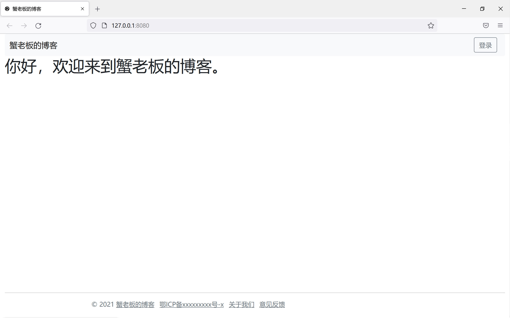

💎本章要点：

- 构建项目
- 模板引擎
- 静态文件

# 构建项目

🔑 新建一个 GitHub 仓库：crab，并克隆到本地。

🔑 用 VSCode 打开 crab，新建`Cargo.toml`文件：

```toml
[package]
name = "crab"
version = "0.1.0"
edition = "2021"

# See more keys and their definitions at https://doc.rust-lang.org/cargo/reference/manifest.html

[dependencies]
tide = "0.16.0"
async-std = { version = "1.8.0", features = ["attributes"] }
serde = { version = "1.0", features = ["derive"] }
```

🔑 新建文件夹 `src`，在里面新建文件 `main.rs`：

```rust
use tide::prelude::*;
use tide::Request;

#[async_std::main]
async fn main() -> tide::Result<()> {
    tide::log::start();
    let mut app = tide::new();
    app.at("/").get(home);
    app.listen("127.0.0.1:8080").await?;
    Ok(())
}

async fn home(req: Request<()>) -> tide::Result {
    Ok("Hello, Rust!".into())
}
```

🔑 运行程序：`cargo run`，打开浏览器就可以看到 `Hello, Rust!`。

📝要点解读：

- 我们选用 [tide](https://crates.io/crates/tide) 框架，建议用 `tide = "0.16.0"` 这个版本学习，不然会出现兼容性问题。
- 代码很清晰易懂：实现了一个简单的路由处理函数 `home` 处理首页 `get` 请求。
- 编写 web 程序需要频繁的改动并查看结果，配置自动重新编译工具 [cargo-watch](https://crates.io/crates/cargo-watch)：

```shell
cargo install cargo-watch
cargo watch -x run
```

# 使用模板引擎

目前 web 开发有两种基本模式：前后端分离模式和模板渲染模式。

前后端分离模式把 UI 逻辑与数据逻辑分开，需要建立前端与后端两个项目，适合构建数据密集型与交互密集型应用，适合团队合作。

模板渲染模式直接返回 HTML 页面，优点是简单，特别适合个人开发者；缺点是难以构建数据密集型与交互密集型应用。

 🔑 添加模板引擎依赖：

```toml
tera = "1.6.1"
tide-tera = "0.2.4"
```

🔑 项目根目录新建一个文件夹：`templates`，在里面添加文件：`home.html`：

```html
<!DOCTYPE html>
<html lang="zh">

<head>
    <title>蟹老板的博客</title>
</head>

<body>
    <h1>{{ hello }}，欢迎来到蟹老板的博客。</h1>
</body>

</html>
```
🔑 修改 `src/main.rs` ：
```rust
use tera::Tera;
use tide::prelude::*;
use tide::Request;
use tide_tera::prelude::*;

#[async_std::main]
async fn main() -> tide::Result<()> {
    tide::log::start();
    let tera = Tera::new("templates/**/*")?;

    let mut app = tide::with_state(tera);
    app.at("/").get(home);
    app.listen("127.0.0.1:8080").await?;
    Ok(())
}

async fn home(req: Request<Tera>) -> tide::Result {
    let tera = req.state();
    let hello = "你好";
    tera.render_response("home.html", &context! { "hello" => hello })
}
```

🔑 运行：`cargo watch -x run`。

📝要点解读：

- [Tera](https://tera.netlify.app/docs/) 是 Rust 语言的模板引擎，类似 Python 语言的 `Jinja2` 和 `Django templates`。如果你没有这方面的经验，建议阅读它的文档。
- `    <h1>{{ hello }}，欢迎来到蟹老板的博客。</h1>` 与 `    tera.render_response("home.html", &context! { "hello" => hello })` 对应了变量：`hello`。
- 注意 `let tera = Tera::new("templates/**/*")?;` 的路径不要弄错了。

# 静态文件

所谓的静态文件一般指的是网站 LOGO，CSS，JS 等文件。 

 🔑 新建文件 `templates/layout.html`：

```html
<!DOCTYPE html>
<html lang="zh">

<head>
    <meta charset="utf-8" />
    <meta name="viewport" content="width=device-width" />
    <link rel="shortcut icon" href="/public/favicon.svg" />
    
    
    <link href="https://cdn.jsdelivr.net/npm/bootstrap@5.0.1/dist/css/bootstrap.min.css" rel="stylesheet"
        integrity="sha384-+0n0xVW2eSR5OomGNYDnhzAbDsOXxcvSN1TPprVMTNDbiYZCxYbOOl7+AMvyTG2x" crossorigin="anonymous">
    <link rel="stylesheet" href="https://cdn.jsdelivr.net/npm/@fortawesome/fontawesome-free@5.15.3/css/all.min.css">
    <link rel="stylesheet" href="https://cdn.jsdelivr.net/npm/katex@0.13.11/dist/katex.min.css"
        integrity="sha256-hFAmQt2dGk6G99nu2cEWz8/1JGRnBP/BsGoZwQ7WeLE=" crossorigin="anonymous">
    <link rel="stylesheet" href="/public/css/main.css">
</head>

<body class="container-fluid">
    <div class="stiky-footer">
        {#################################################################}
        {# header component #}
        {#################################################################}
        <header>
            <nav class="navbar navbar-expand-md navbar-light bg-light rounded" aria-label="navbar">
                <div class="container-fluid">
                    <a class="navbar-brand" href="/">蟹老板的博客</a>
                    <button class="navbar-toggler" type="button" data-bs-toggle="collapse"
                        data-bs-target="#navbarContent" aria-controls="navbarContent" aria-expanded="false"
                        aria-label="Toggle navigation">
                        <span class="navbar-toggler-icon"></span>
                    </button>
                    <div class="collapse navbar-collapse row" id="navbarContent">

                        <ul class="nav justify-content-end">
                            <li class="nav-item">
                                <a class="btn btn-outline-secondary me-2" aria-current="page" href="/login">登录</a>
                            </li>
                        </ul>
                    </div>
                </div>
            </nav>
        </header>

        {#################################################################}
        {# main component #}
        {#################################################################}
        <main>
            
            
        </main>
    </div>


    {#################################################################}
    {# footer component #}
    {#################################################################}
    <footer class="stiky-footer-height">
        <hr class="my-3">
        <div class="row">
            <div class="col-md-8 mx-auto">
                <span class="link-secondary mx-1">
                    © 2021
                    <a class="link-secondary" href="https://lookelooke.com">蟹老板的博客</a>
                </span>
                <span class="mx-1">
                    <a class="link-secondary" href="https://beian.miit.gov.cn/">鄂ICP备xxxxxxxxx号-x</a>
                </span>
                <a class="link-secondary mx-1" href="#">关于我们</a>
                <a class="link-secondary mx-1" href="#">意见反馈</a>
            </div>
        </div>
    </footer>
    <script src="https://cdn.jsdelivr.net/npm/bootstrap@5.0.1/dist/js/bootstrap.bundle.min.js"
        integrity="sha384-gtEjrD/SeCtmISkJkNUaaKMoLD0//ElJ19smozuHV6z3Iehds+3Ulb9Bn9Plx0x4"
        crossorigin="anonymous"></script>
    <script src="https://cdn.jsdelivr.net/npm/jquery@3.6.0/dist/jquery.min.js"
        integrity="sha256-/xUj+3OJU5yExlq6GSYGSHk7tPXikynS7ogEvDej/m4=" crossorigin="anonymous"></script>
    <script src="https://cdn.jsdelivr.net/npm/katex@0.13.11/dist/katex.min.js"
        integrity="sha256-+EWBEj6A8lxFvckkChitv8/RcHK/PcWvQV+D7PDflC8=" crossorigin="anonymous" async></script>
    <script src="https://cdn.jsdelivr.net/npm/prismjs@1.25.0/prism.min.js"></script>
    <script src="https://cdn.jsdelivr.net/npm/prismjs@1.25.0/plugins/autoloader/prism-autoloader.min.js"></script>
    
    
    <script src="/public/js/main.js" async></script>
</body>

</html>
```

 🔑 修改 `templates.home.html`：

```html




<title>蟹老板的博客</title>



<h1>{{ hello }}，欢迎来到蟹老板的博客。</h1>

```

📝要点解读：

- 关于 `` ：对比上下两个 `html` 你会发现它的作用是定义了一个扩展点。
- 关于 `{# header component #}`：注释。

- 从 `layout` 的结构来看，我们添加了常用的前端组件：

（1）`bootstrap` ：CSS 库

（2）`jquery`：简化 JS 操作的库

（3）`fortawesome`：图标库

（4）`katex` ：数学公式渲染

（5）`prismjs`：代码高亮

- 需要注意的是：

`<link rel="shortcut icon" href="/public/favicon.svg" />`

`<link rel="stylesheet" href="/public/css/main.css">`

`<script src="/public/js/main.js" async></script>`

这三个文件就是我们自己的静态文件。

🔑 新建文件夹：`public/css`，添加文件：`public/css/main.css`:

```css
/* begin stiky-footer 页脚沉底
* https://css-tricks.com/couple-takes-sticky-footer/ 
*/
.stiky-footer {
    min-height: calc(100vh - 80px);
}

.stiky-footer-height {
    height: 60px;
}
/* end stiky-footer */
```

🔑 新建文件夹：`public/js`，添加文件：`public/js/main.js` 备用。

🔑 从 [Rust 官网](https://www.rust-lang.org/) 把 logo 另存为到 `public` 文件下，文件名为 `favicon.svg`。

🔑 修改 `src/main.rs`：

```rust
use tera::Tera;
use tide::prelude::*;
use tide::Request;
use tide_tera::prelude::*;

#[async_std::main]
async fn main() -> tide::Result<()> {
    tide::log::start();
    let tera = Tera::new("templates/**/*")?;

    let mut app = tide::with_state(tera);
    app.at("/").get(home);
    app.at("/public").serve_dir("public/")?;
    app.listen("127.0.0.1:8080").await?;
    Ok(())
}

async fn home(req: Request<Tera>) -> tide::Result {
    let tera = req.state();
    let hello = "你好";
    tera.render_response("home.html", &context! { "hello" => hello })
}
```

我们添加了一行：`app.at("/public").serve_dir("public/")?;`

🔑 运行，打开浏览器得到最终效果：



📝要点解读：

- 要特别注意 `app.at("/public").serve_dir("public/")?;` 两边路径的对应关系。
- 可以使用 `Ctrl+F5` 刷新浏览器缓存。

# 小结

我们已经完成了博客网站框架的搭建，接下来我们将实现网站功能。

❓ 思考：Rust 语言的相对路径是如何确定的？

