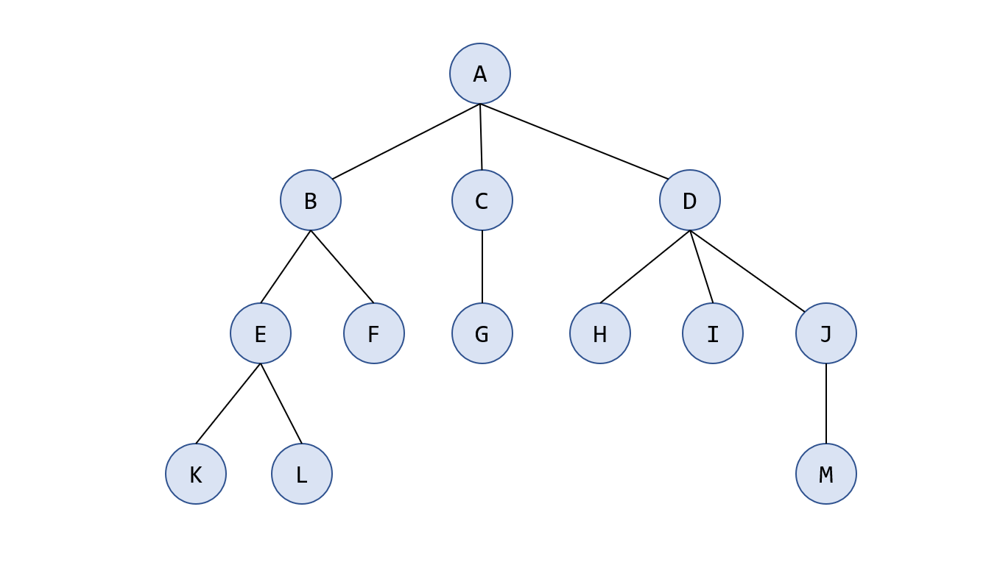

# 树的基本概念
## 树的定义

**树 (树状图) **是一种数据结构，它是由 $n(n\ge 0)$ 个结点组成一个具有层次关系的有限集合。把它叫做“树”是因为它看起来像一棵倒挂的树，也就是说它是根朝上，而叶朝下的，如下图所示：

当 $n = 0$ 时，称为空树。

**树具有以下的特点：**

- 每个结点有零个或多个子结点，如果没有子结点，称为**叶子结点**，如 K，L，F，G，H，I，M；
- 没有父结点的结点称为根结点，上图 A 是根节点；
- 每一个非根结点有且只有一个父结点，例如 C 是 G 的父节点；
- 除了根结点外，每个子结点可以分为多个不相交的子树；

思考：有 $n$ 个结点的树有多少条边？

## 基本术语

- 节点深度： 对任意节点 N，N 的深度表示为根节点到 N 的路径的长度，所以根节点深度为 0，第二层节点深度为 1，以此类推。
- 树的深度：一棵树中节点的最大深度就是树的深度，有时也称为高度。
- 祖先结点：根 A 到结点 K 的路径上的任意结点，称为结点 K 的祖先（包括自己）。
- 子孙结点：例如B 是结点 K 的祖先，而结点 K 是结点 B  的子孙。
- 双亲结点：路径上最接近结点 K 的结点 E 称为 K 的双亲，而 K 为结点 E 的孩子。根 A 是树中唯一没有双亲的结点。
- 兄弟结点：有相同双亲的结点称为兄弟，如结点 K 和结点 L 有相同的双亲 E，即 K 和 L 为兄弟。
- 结点的度：一个结点的孩子个数称为该结点的度，树中结点的最大度数称为树的度。例如结点 B 的度为2，结点 D 的度为3，树的度为 3。

- 路径和路径长度：树中两个结点之间的路径是由这两个结点之间所经过的结点序列构成的，而路径长度是路径上所经过的边的个数。

## 树的性质
- 树中的结点数等于所有结点的度数之和加1.
  【证明】因为结点的度定义为该结点孩子的个数，所以所有结点的度之和为所有孩子结点的个数，因为根不是任何结点的孩子，所以树中的结点数等于所有结点的度数之和加1。

- 度为 $m$ 的树中第 $i$ 层上至多有 $m^{ i − 1}$ 个结点。
- 高度为 $h$ 的 $m$ 叉树至多有 $\frac{m^{i-1}}{m-1}$ 个结点。

# 参考文章

1. 【UniqueUnit@CSDN】遵循CC 4.0 BY-SA版权协议，原文链接：https://blog.csdn.net/Real_Fool_/article/details/113930623
