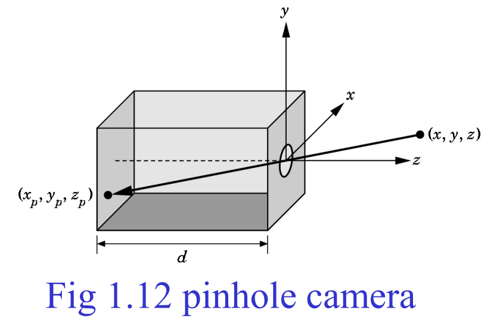
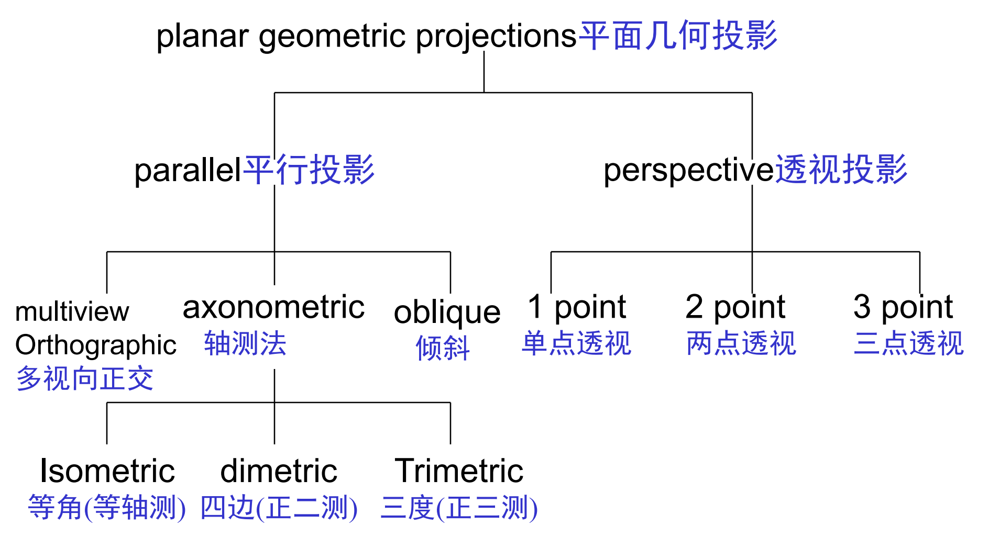
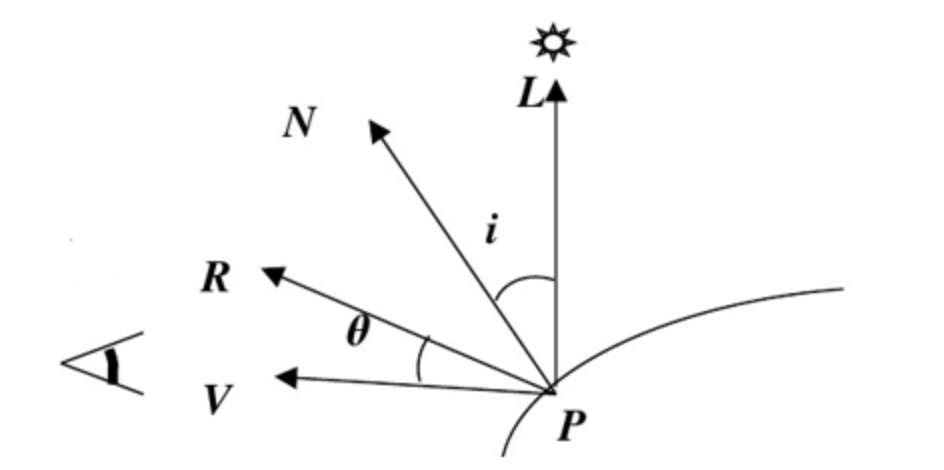
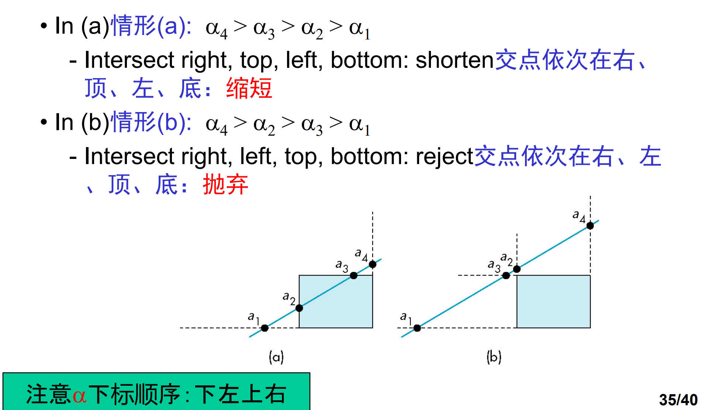
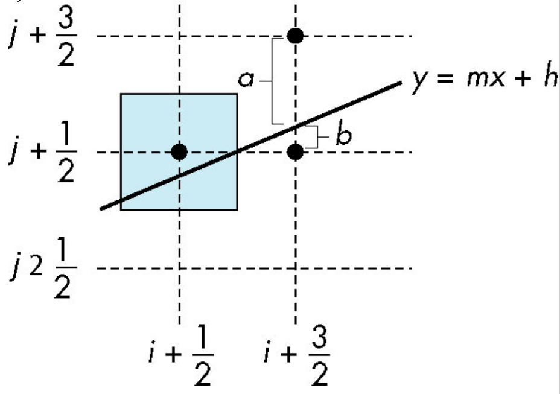
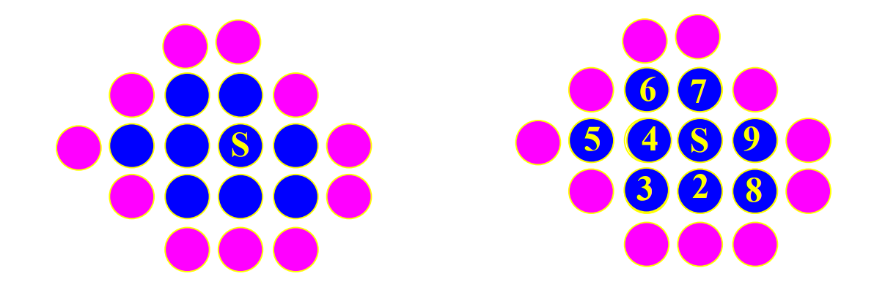
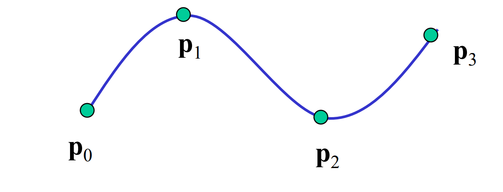
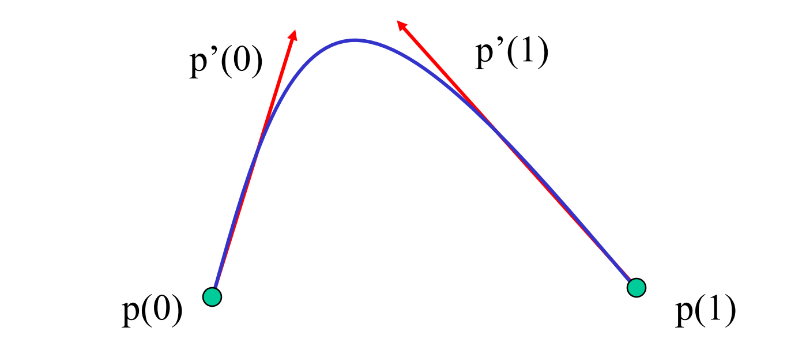
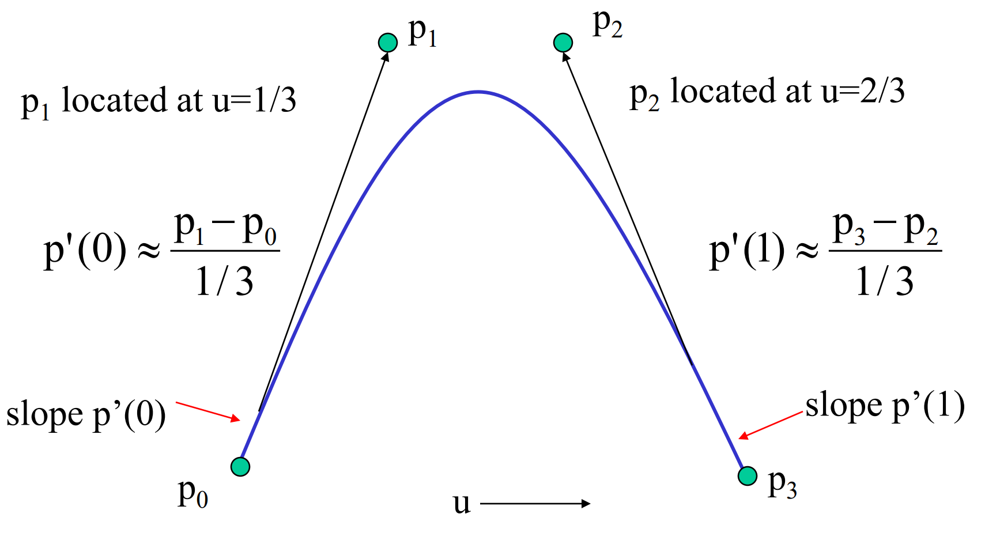

# 图形学复习提纲

# Chapter 1 基本概念

计算机图形学的基本应用：（1）信息的显示（2）设计（3）仿真和动画（4）用户界面。

图形系统包括了如下6个元素：（1）输入设备（2）CPU（3）GPU（4）存储器（5）帧缓存（6）输出设备。

像素：对应图像的一个位置；

光栅：像素阵列；

帧缓存：缓存图像的区域，一帧还有的像素数称为分辨率，通常用长*宽表示。

深度：每个像素所用的比特数，用来表示像素的颜色等信息。全彩色是至少 8*3=24位。

光栅化：把几何物体转化为帧中像素的计算过程。

刷新率：显示器每秒绘制的帧数。

计算机图形学的历史（Ivan Sutherland）

人类视觉系统（如光谱、颜色模型等）



根据相似三角形可以得出：$(x_p,y_p,z_p)=(-d\frac{x}{z},-d\frac{y}{z},-d)$。

【颜色模型】

加色模型的三原色是RGB，值为0.0.0是黑色；值为255.255.255是白色。，多用于显示器，灯光。减色模型三原色是CMY，值为0.0.0则为白色，值为255.255.255则为黑色，多用于印刷。

加色模式使颜色变亮，减色模式使颜色变暗。

【三维图形的处理流程】

- 顶点处理模块：涉及坐标变换与颜色值计算，还可能将3D图像投影为2D图像。
- 裁剪和图元组装模块：显示器的大小是有限制的，需要把顶点组装成线段或多边形这样的图元，然后对图元进行裁剪。
- 光栅化模块：把图元转化为片元，片元是携带位置与颜色信息的潜在像素点。
- 片元处理模块：处理纹理映射，遮挡信息等，然后更新帧缓存里的像素。

# Chapter 3 输入与交互

双缓存等概念

## 物理设备

物理设备主要有两种类型：

定位设备：在显示器指示一个位置，允许用户发送信号或中断；

键盘设备：对应于物理键盘，可以推广到任何返回字符码的设备。

## 逻辑设备

字符串设备：提供ascII 码串的逻辑设备

定位设备：提供对象位置的世界坐标

拾取设备：把对象的标识符返回给用户程序

选择设备：从多个离散的对象中选择一个。

定值设备：向用户程序提供模拟输入

笔划设备：笔划设备返回一个位置数组。

## 三种基本的输入模式

 请求模式：除非设备被触发，否则设备的测量数据不会被返回给程序。

采样模式：输入是及时的，只要用户程序遇到函数调用，就把测量数据返回给程序，因此不需要触发器。

事件模式：每当设备被触发，就产生了一个事件，相关数据信息被放到一个事件队列中。

# Chapter 4 几何变换

参考文章：[OpenGL 的空间变换（上）](https://www.cnblogs.com/ojo-blogs/p/6754589.html)

标量、向量、点的概念

点积和叉积（几何意义）

## 维数、基、坐标系与标架

基向量定义了一个坐标系。

原点和基向量决定了一个标架。

## 齐次坐标的定义与作用

（1）使用齐次坐标，可以表示平行线在透视空间的无穷远处交于一点，然而在欧氏空间不能表示。

（2）齐次坐标的作用，把各种变换：如缩放，旋转，平移等，都统一起来，都表示成一连串的矩阵相乘的形式。

## 三种基本变换：平移、旋转、缩放（2D与3D）

【平移变换】
$$
\begin{bmatrix}
1 & 0 & 0 & t.x\\
0 & 1 & 0 & t.y\\
0 & 0 & 1 & t.z\\
0 & 0 & 0 & 1 \\
\end{bmatrix}
$$
其中 $t.x,t.y$ 和 $t.z$ 分别表示在 $x$ 轴、$y$ 轴和 $z$ 轴上的平移。

【旋转】
$$
R_x(\theta)=\begin{bmatrix}
1 & 0 & 0 & 0\\
0 & c_{\theta} & s_{\theta} & 0\\
0 & -s_{\theta} & c_{\theta} & 0\\
0 & 0 & 0 & 1 \\
\end{bmatrix}

R_y(\theta)=\begin{bmatrix}
c_{\theta} & 0 & -s_{\theta} & 0\\
0 & 1 & 0 & 0\\
s_{\theta} & 0 & c_{\theta} & 0\\
0 & 0 & 0 & 1 \\
\end{bmatrix}

R_z(\theta)=\begin{bmatrix}
c_{\theta} & -s_{\theta} & 0 & 0\\
s_{\theta} & c_{\theta} & 0 & 0\\
0 & 0 & 1 & 0\\
0 & 0 & 0 & 1 \\
\end{bmatrix}
$$
旋转轴与坐标轴平行时，可以先把原点平移到旋转轴上，然后做旋转变换，最后再变平移回来：$v’=T(x,y)*R*T(-x,-y)$；


## 绕任意轴的旋转、组合变换（顺序问题）

参考文章：[绕任意轴旋转 - 翰墨小生 - 博客园 (cnblogs.com)](https://www.cnblogs.com/graphics/archive/2012/08/10/2627458.html)。

## 多边形网格、多面体、欧拉公式、四元数？

**四元数**可以表示为 (a, b, c, d)，我们定义其与旋转轴 A、旋转角度 θ 的关系如下：

a = sin(θ/2) * A.x
b = sin(θ/2) * A.y
c = sin(θ/2) * A.z
d = cos(θ/2)

其中，A.x、A.y、A.z 分别对应旋转轴 A 的三个分量。

 **欧拉公式**：$V-E+F=2$。

# Chapter 5 投影与视图

## 几类经典投影



**透视投影**是从某个投影点将物体投影到单一投影面上所得到的图形，透视投影有近大远小效果。

特点：

（1）在一条直线等距的几点投影后不一定等距（非均匀收缩），距离扭曲；

（2）只有在平行于投影面的平面上的角度被保持

（3）相对于平行投影而言，更难用手 工进行绘制（但对计算机而言，没有增加更多的困难）

**平行投影**是在一束平行光线照射下形成的投影。

特点：（1）有类似性；（2）保平行性；（3）平行于投影面的直线，其投影反映直线的实长

## 模型视图变换

如果我们要观察一个物体，我们可以从不同的位置去观察它（视图变换）；移动或者旋转它（模型变换）。如果把物体画下来，我们可以选择：是否需要一种“近大远小”的透视效果（投影变换）；我们可能只希望看到物体的一部分，而不是全部（剪裁）；我们可能希望把整个看到的图形画下来，但它只占据纸张的一部分，而不是全部（视口变换）。

（1）模型坐标与世界坐标转换：
$$
P_W=T_WP_M
$$
（2）不同位置观察物体，决定了采用哪种视图坐标系（或者叫相机坐标系）。下面公式计算世界坐标系的点在视图坐标系中的位置。
$$
P_V=T_VP_W
$$
（3）`gluLookAt(eye.x, eye,y, eye.z, look.x, look.y, look.z, up.x, up.y, up.z)` 就是设置视图（相机，观察者）坐标系的。

## 投影变换

投影变换将在模型视图变换之后应用到顶点上，这种投影实际上定义了视景体并创建了裁剪平面。投影一般分为正投影和透视投影。正投影大多在进行2D绘制使用,`glOrtho(left, right, bottom, top, near, far)` 创建一个平行六面体的视景图。

透视投影所显示的场景有近大远小的效果。设置视景体可以使用 `gluPerspective (GLdouble fovy, GLdouble aspect, GLdouble zNear, GLdouble zFar)` 和 `glFrustum(GLdouble left, GLdouble right, GLdouble bottom, GLdouble top, GLdouble nearVal, GLdouble farVal)`，二者达到的效果相同。

参数说明：

（1）第一个参数 flvy, 定义可视角的大小，flvy值小，表示从相机出发的光线的角度小，此时同等距离下，可观察到的视野范围较小，反之则大。从物体显示在画板的大小来反映，如果flvy值较大，则物体在画板中所占比例就较少，看起来比较小，反之则显示比较大。
（2）第二个参数 aspect，定义物体显示在画板上的x和y方向上的比例。aspect 小于1，则物体显示出来比实际更高，大于1，显示出来比实际看起来更宽，设为1，会按实际反应长宽比。
（3）第三个参数zNear,定义距离相机最近处物体截面相距的距离。这个值越大，表示观测点距离物体距离越远，看起来物体就比较小，反之则比较大。如果物体运动到距离观测点的距离小于了设定的zNear,则物体不会被绘制在画板上。
（4）第四个参数zFar,定义可观测到的物体的最远处截面相距相机的距离。如果物体运动到距离观测点的距离大于了设定的zFar,则物体不会被绘制的画板上。

## 视口变换

利用 `glViewport(GLint x, GLint y, GLint width, GLint height)` 设置视口的左下角，以及宽度和高度。


参考链接：https://blog.csdn.net/webzhuce/article/details/79056031


# Chapter 6 光照与着色

## Phong 光照模型

Phong 光照模型由三类分量构成：环境光(Ambient)、漫反射光(Diffuse)、镜面反射光(Specular)，可用公式描述为：
$$
I = k_dL_d\max(\vec{l}\cdot\vec{n}, 0) + k_sL_s\max((\vec{v}\cdot\vec{r})^{\alpha}, 0) + k_aL_a
$$
其中：

$k_d$：漫反射系数，$L_d$：光垂直入射时反射光亮度，$\vec{l}$：入射点到光源方向的法向量，$\vec{n}$：物体表面单位法向量。

$k_s$：镜面反射系数，$L_s$：入射光亮度，$\vec{v}$：视线方向，$\vec{r}$：反射光方向

$k_a$：环境光反射系数，$L_a$：环境光亮度。




## 改进的 Phong 光照模型

【法向量计算】

- 二次曲面和 Bézier 曲面由 OpenGL 计算

- 其他的，OpenGL 把法向量的计算留给应用程序，顶点法向用如下函数来指定和定义 `glNormal3f(nx, ny, nz);` 与 `glNormal3fv(pointer_to_normal);`

## 多边形网格的明暗处理

【Flat(平坦)明暗处理】

Flat 明暗处理要点：

（1）在同一多边形上法向 $\vec{n}$ 为常向量；（2）视点在无穷远，视点方向 $\vec{v}$ 是常向量 ；（3）光源在无穷远，入射方向 $\vec{l}$ 也是常向量；（4）对于每个多边形，只需要计算其上一点的颜色 ，其他点的颜色与它相同。

OpenGL 函数：`glShadeModel(GL_FLAT)`。

特点：

（1）同一多边形上颜色相同，每个多边形颜色不同；（2）如果多边形网格表示的是一个光滑曲面，那么这种效果显然是不令人满意的；（3）曲面体将失去原曲面光滑性，呈多面体状，这是因为物体表面光亮度呈现不连续跃变。

【Gouraud (平滑)明暗处理】

Gouraud 明暗处理要点：（1）在网格中每个顶点处有几个多边形交于该点，每个多边形有一个法向，取这几个法向的平均化得到该点的法向；（2）然后利用光照模型计算出顶点的颜色；（3）对于多边形内的点，采用线性插值确定其颜色。

平均化公式：
$$
\vec{n}=\frac{\vec{n_1}+\vec{n_2}+\vec{n_3}}{\lvert n_1+n_2+n_3\rvert}
$$
OpenGL API：`glShadeModel(GL_SMOOTH);`

【Phong 明暗处理】

Phong 明暗处理要点：根据每个顶点的法向，插值出多边形内部各点的法向，然后基于光照模型计算各点的颜色。

特点：

（1）通常会有效地降低 Mach 带效应；（2）法向是局部的，法向插值之后，平面看起来像曲面；（3）得到的图形比应用 Gouraud 方法的结果更光滑；（4）能够反映高亮效果；（5）由于法向的计算还是很复杂，一般难以得到实时图形，所花费时间通常是 Gouraud 方法的6到8倍。


# Chapter 7 底层实现

## 面向图像与面向对象的方法

【面向对象方法优缺点】

优点：处理速度快，运行成本低。

缺点：（1）需要占用大量内存，每个对象单独处理的代 价较大。由于低价大容量内存，以及专用硬件芯 片的出现，现在已不再是问题（2）不能得到大多数全局效果，例如涉及多个对象的复杂光照

【面向图像方法优缺点】

优点:（1）任何时刻只需有限的显示内存，且可以按显示器的刷新速度和次序生成像素（2）利用相邻像素间的连贯性可设计增量式算法 （3）适合处理全局效果

缺点:（1）需要复杂的几何对象的数据结构（2）必须确定哪些图元影响哪些像素（3）绘制过程中需要随时访问所有的几何数。


## 线段的裁剪

【Cohen-Sutherland 法】

参考：[Cohen-Sutherland算法 - cnblog-null - 博客园 (cnblogs.com)](https://www.cnblogs.com/cnblog-wuran/p/9813788.html)

编码 b0b1b2b3：

b0 = 1 if y > ymax, 0 otherwise 

b1 = 1 if y < ymin, 0 otherwise 

b2 = 1 if x > xmax, 0 otherwise 

b3 = 1 if x < xmin, 0 otherwise

（1）AB: A | B = 0000  --->  Accept；EF: E & F  ≠ 0  ---> reject

（2）其他情况：拿一条或为1的边求交，用交点替换1对应的点，然后用（1）判断。

【Liang-Barsky 法】

考虑线段的参数化表示：
$$
P(\alpha) = (1-\alpha)P_1+ \alpha P_2 \quad (1 ≥ \alpha ≥ 0)
$$
计算出线段所在直线与窗口各边交点对应的α值后 ，可以通过这些参数α值的排序区分出各种相交的情形。



优势：

（1）与Cohen-Sutherland 算法一样很简单地接受或拒绝；

（2）可利用α值方便地进行后续处理 （一次性求交分割），而不必像Cohen-Sutherland算法 那样进行重复求交分割；

（3）可以推广到三维的情形。

## 多边形裁剪

背面剔除：$\vec{v}\cdot\vec{n} ≥ 0$，视线与平面法向夹角 $-90 \le \theta \le 90$

【画家算法】

（1）假设场景内的多边形已按离观察者的距离排序，按从远到近的顺序把每个多边形完全绘制出来。并不是所有的多边形都完全在其他多边形的前面或后面。

（2）进行排序时， 先处理简单情形，再处理困难情形。

【深度缓存算法(Z-Buffer)】

（1）用一个称为z缓冲区或者深度缓冲区的地方存储每个像素到目前为止找到的离视点最近对象（交点）的深度值。

（2）当绘制每个多边形时，把每个（像素）片元的深度与z缓冲区中存储（已有）的深度值作比较。

（3）如果新值小的话，把新的亮度值放到颜色缓冲区中并用新深度值更新z缓冲区对应位置上的深度值。

【扫描线算法】

（1）扫描线算法中把明暗处理算法与隐藏面消除算法结合在一起。

（2）当遇到多个多边形时，才需要深度信息，否则不需要深度信息。


## 扫描转换算法

【平凡算法】

```c++
for(x=x1; x<=x2; ++x){
    y = m*x+h;
    write_pixel(x, round(y), color);
}
```

【DDA 算法】

Digital Differential Analyzer 数值微分法（DDA）。

直线 $y=mx+ h$ 满足微分方程：
$$
\frac{dy}{dx} = m = \frac{\Delta y}{\Delta x} = \frac{y2-y1}{x2-x1}
$$
沿扫描线有 $\Delta x = 1$，则 $\Delta y = m$。

```c++
for(x=x1; x<=x2; ++x) { 
    y+=m;
    write_pixel(x, round(y), color);
}
```

对于斜率大的直线有问题：取样空隙，解决方案：

（1）只对 $0 \le |m|\le 1$ 的直线应用上述算法 ；

（2）对于 $|m|>1$ 的直线， 利用对称性，交换 $x$ 与 $y$ 的角色。

【Bresenham 画线算法】

前提假设：只考虑0 ≤m ≤1的情形，其它情形利用对称性处理；像素中心在半整数（或整数）位置。

（1）如果从一个已确定被激活的像素出发， 那么下一像素的可能位置只会有两种可能：右和右上。

（2）考虑 $X_k$ 处决策变量：$d_k = \Delta x(b_k-a_k)$，$d_k > 0$ 采用右上像素， $d_k < 0$ 采用右像素。

（3）决策变量有如下递推关系：
$$
d_{k+1}=
\begin{cases}
d_k –2\Delta y &d_k>0\\
d_k –2(\Delta y-\Delta x)   &d_k\le 0
\end{cases}
$$
 在 $X=X_1$处，$a=1, b=0, d=−\Delta x<0$。



## 多边形的扫描转换：ET、AET、奇偶规则、特殊情况处理

【内外检测】

奇偶检测（射线）法：

（1）从一点 p 引射线，如果与多边形边界交点数为偶数，则 p 在多边形外，否则在多边形内部

（2）如果交点为顶点，需要特别处理

（3）通常射线就是扫描线

【环绕测试法】

（1）根据多边形的边界建立一条环路 ：从一个顶点出发，依次遍历各边，最后回到该顶点 

（2）一点的环绕数计算：被多边形各边按上述环路遍历所环绕的次数，顺时针方向为正，逆时针方向为负

（3）内外检测：如果环绕数不等于 0，就是内部。

【漫水填充法】

如果已知多边形区域和位于内部的一个种子点，那么可以把多边形的边扫描转化为内部填充颜色。

算法步骤：

首先将种子象素入栈，当栈非空时，执行如下三步操作：

（1）栈顶象素出栈； （2）将出栈象素置成多边形色 ； （3）按某个固定次序（例如上、下、左、右），检查与 出栈象素相邻的四个象素，若其中某个象素不在边界上并且未置成多边形色，则把该象素入栈。



【扫描线填充算法】

参考文章：[扫描线填充算法](https://blog.csdn.net/wodownload2/article/details/52154207)

通过维持一个特别的数据结构(保存扫描线与多边形的交点)进行填充。

边结点数据结构：
(1) 该边y的最大值y;
(2) 该边底端的x坐标xi;
(3) 该边的斜率的倒数1/m;
(4) 以及下一个边记录地址的指针;

算法详情：


（1）建立ET(边表)：
	（a）与 $x$ 轴平行的边不计入；
	（b）多边形的顶点分为两大类：一类是局部极值点，如上图的P1和P3。另外一类是非极值点，如上图的P2、P4、P5。当扫面线与第一类顶点相交时，应看作两个点；而当扫描线与第二类顶点相交时，应视为一个点；
对于极值点则要记录两条边；
	（c）对扫描线 $j$ 按照从低到高的顺序，如果一条边的 $y_{min} ==j$，将其加入 $ET[j]$ 中；

（2）初始化扫描线坐标 $y$ 为 ET 中最小者 ，初始化 AET（活动边表）为空；

（3）执行下列步骤直至 ET 和 AET 都为空：

​	（a）将 ET 表中与当前扫描线 $y$ 对应的结点添加到 AET 中，同时对 AET 按 $x$ 值从小到大排序；

​	（b）在一对交点之间填充所需要的像素；

​	（c）为下一条扫描线准备：从 AET 中删去 $y＞y_{max}$ 的项，对于仍留在AET中的每一项，用 $x+\Delta x$ 代替  $x$；

​	（d）使 $y$ 增 1，成为下一条扫描线。

## 走样（若干现象）与反走样（两种方法）

走样现象：（1）线段和多边形边线光栅化结果呈锯齿状（2）走样源于把连续表示的对象（无限分辨率） 转换为离散（点阵）的采样近似表示（有限分辨率）

原因：（1）大小为 $n\times m$ 的帧缓冲区，像素个数固定不变（2）像素位置固定于均匀分布栅格上（3）像素的大小和形状固定

反走样方法：（1）面积平均反走样方法：对每个x，根据理想直线所覆盖的面积对多个像素着色；（2）增加分辨率（3）插值。


#  Chapter 11 曲线与曲面

本章可参考：[计算机图形学 学习笔记（九）：曲线曲面（一）：参数曲线、参数几何代数形式 - 菜鸟学院 (noobyard.com)](http://www.noobyard.com/article/p-sltpaoae-pz.html)

## 曲线与曲面的表示形式

显式表示：2D 曲线：$y=f(x)$，3D 曲线：$ y=f(x), z=g(x)$，3D 曲面：$z = f(x,y)$;

隐函数式：2D 曲线：$g(x,y)=0$，3D 曲面：$g(x,y,z)=0$；

参数曲线：$x=x(u);\quad y=y(u);\quad z=z(u)$

参数曲面：$x=x(u,v);\quad y=y(u,v);\quad z=z(u,v)$

## 参数多项式曲线曲面

参数多项式曲线：
$$
x(u)=\sum_{i=0}^N c_{xi}u^i;\quad y(u)=\sum_{i=0}^N c_{yi}u^i;\quad z(u)=\sum_{i=0}^N c_{zi}u^i;\quad 
$$
三次多项式曲面：
$$
P(u,v)=[x(u,v), y(u,v), z(u,v)]
$$
每项都有如下形式：
$$
\sum_{i=0}^3\sum_{j=0}^3 c_{ij}u^iv^j
$$

## 线段连续型

【位置连续性】

曲线段 $r_1(u_1)$ 末端与曲线段 $r_2(u_2)$ 的首端达到位置连续性(也叫 $C^0$ 连续)的条件为：
$$
r_1(1)=r_2(0)
$$
【斜率连续】

斜率连续条件：
$$
r'_1(1)=kr'_2(0)
$$
若 $k=1$  则说明切矢量方向与大小相等，此时称为 $C^1$ 连续，否则只有方向相等，称为几何连续( $G^1$ 连续)。

【曲率连续】

如果满足条件：$r_2''(0)=\alpha r_1''(1)+\beta r_1'(1)$， 称为 $G_2$ 连续；

如果满足条件：$r_2''(0)=r_1''(1)$，称为 $C^2$ 连续。

参数连续：不同曲线如果都用参数方程来描述, 那么在连接点处 $n$ 阶导数连续, 就是$C^n$连续。但存在的问题是：对同样的曲线，用不同的参数来描述，其连续性会变化。

为了避免这个问题，人们就提出了几何连续, 提出了自然参数方程：既然不同的参数来描述引起其连续性会变化，那就直接固定参数，定义参数方程的参数是曲线的弧长$s$, 这就是自然参数方程。不同曲线如果都用自然参数方程来描述, 并且在连接点处$n$阶导数相等, 就是$G^n$连续。

## 参数三次曲线

三次曲线每个分量可以表示成矩阵形式：$\mathbf{c}=[c_0, c_1,c_2,c_3]^{\mathrm{T}},\quad \mathbf{u}=[u_0, u_1,u_2,u_3]^{\mathrm{T}};\quad x=\mathbf{c}^{\mathrm{T}}\mathbf{u}$；

【曲线插值】



给定四个控制（数据）点：$P_0, P_1 ,P_2 , P_3$，求出四个系数：$ c_0 ,c_1 ,c_2 , c_3 $。选取插值点：$u=0, 1/3, 2/3, 1$，则有：
$$
\mathbf{P}= \mathbf{A}\mathbf{c}=
\begin{bmatrix}
1&0&0&0\\
1&(1/3)& (1/3)^2 & (1/3)^3\\
1&(2/3)& (2/3)^2 & (2/3)^3\\
1&1&1&1\\
\end{bmatrix}
\mathbf{c}
$$
解得：
$$
\mathbf{c}=\mathbf{A}^{-1}\mathbf{P}
$$
【哈米特形式】




约束方程：两个插值，两个导数连续
$$
\begin{align}
p(0) &= p0 = c0\\
p(1) &= p3 = c0+c1+c2+c3\\
p’(0) &= p’0 = c1\\
p’(1) &= p’3 = c1+2c2+3c3
\end{align}
$$
同样有 $\mathbf{c}=\mathbf{M}_H\mathbf{q}$，其中：
$$
\mathbf{M}_H=
\begin{bmatrix}
1& 0& 0& 0\\
0& 0& 1& 0\\
-3& 3& -2& -1\\
2& -2& 1& 1\\
\end{bmatrix}
$$

## Bezier曲线曲面

利用数据点插值来逼近哈米特曲线中的导数



同样有$\mathbf{c}=\mathbf{M}_B\mathbf{p}$，其中：
$$
\mathbf{M}_B=
\begin{bmatrix}
1& 0& 0& 0\\
-3& 3& 1& 0\\
3& -6& 3& 0\\
-1& 3& -3& 1\\
\end{bmatrix}
$$

## Bezier曲线绘制：

问题：给定 $n+1$个数据点：$p_0(x_0, y_0),\dots,p_n(x_n, y_n)$，生成一条曲线，使得该曲线与这些点所描述的形状相符。

Bezier曲线段参数方程表示：
$$
p(t)=\sum_{i=0}^{n}P_iB_{i,n}(t)
$$
其中 $P_i$ 是控制多边形的 $n+1$ 个顶点，$B_{i,n}(t)$ 是 Bernstein 基函数：
$$
B_{i,n}(t)=\binom{n}{i}t^i(1-t)^{n-i}
$$
Bezier 曲线的递推计算公式(de Casteljau 算法 )：
$$
P_i^k=
\begin{cases}
P_i, \quad k=0\\
(1-t)P_i^{k-1}+tP_{i+1}^{k-1},\quad k=1,\dots,n\quad i=0,\dots,n-k
\end{cases}
$$
【例题】参考：[计算机图形学 学习笔记（十）：曲线曲面（二）：Bezier 曲线与曲面 - 菜鸟学院 (noobyard.com)](http://www.noobyard.com/article/p-xviivkhj-pz.html)

两个控制点：$p(t)=(1-t)P_0+tP_1$

三个控制点：$p(t)=P_0+2(P_1-P_0)t+(P_2-2P_1+P_0)t^2$

四个控制点：$p(t)=(1-t^3)P_0+3t(1-t)^2P_1+3t^3(1-t)P_2+t^3P_3$

## B样条曲线曲面

参考文章：[B样条曲线曲面（附代码） - NobodyZhou - 博客园 (cnblogs.com)](https://www.cnblogs.com/nobodyzhou/p/5451528.html)

是 B-样条基曲线（给定区间上的所有样条函数组成一个线性空间。这个线性空间的基函数就叫做B样条基函数）的线性组合。

B样条曲线方程可表示为：
$$
p(u)=\sum_{i=0}^n d_iN_{i,k}(u)
$$


其中，$d_i (i=0,1,\dots,n)$ 为控制顶点（坐标），$N_{i,k}(i=0,1,\dots,n)$ 为 $k$ 次规范B样条基函数，最高次数是$k$。基函数是由一个称为节点矢量的非递减参数 $u$的序列 $U：u_0\le u_1\le,\dots,\le u_{n+k+1}$所决定的 $k$ 次分段多项式。

B样条的基函数通常采用Cox-deBoor递推公式：
$$
\begin{cases}
N_{i,0} = 1 \quad \mathrm{if}\quad u_i\le u \le u_{i+1} \quad\mathrm{else}\quad 0\\
N_{i,k} = \frac{u-u_i}{u_{i+k}-u_i}N_{i,k-1}(u)+\frac{u_{i+k+1}-u}{u_{i+k+1}-u_{i+1}}N_{i+1,k-1}(u)\\ 
define \frac{0}{0}=0\\
\end{cases}
$$
式中 $i$ 为节点序号，$k$是基函数的次数，共有 $n+1$个控制顶点。注意区分节点和控制顶点，节点是在节点矢量 $U$中取得，控制顶点则是坐标点，决定 B 样条的控制多边形。Cox-deBoor递推公式是B样条曲线的定义的核心，该公式在程序中的实现可采用递归的方式。

# Chapter 13 高级绘制

## 光线跟踪方法概念

【光线跟踪算法】

对屏幕上每一像素，执行下述4个步骤：

Step1：从视点出发通过该像素中心向场景发出一条光线R，并求出R与场景中物体的全部交点；获得离视点最近交点P；并依据局部光照明模型计算P处颜色值Ic (光线投射) ;

Step2：在P处沿着R镜面反射方向和透射方向各衍生一条光线，若点P所在表面非镜面或不透明体，则无需衍生出相应光线；

Step3：分别对衍生出的光线递归地执行前面步骤，计算来自镜面反射方向和透射方向上周围环境对点P光亮度的贡献Is和It；

Step4：依据Whitted光照明模型即可计算出点P处的光亮度，并将计算出的光亮度赋给该像素。

当所有屏幕像素都处理完毕时，即得到一幅真实感图形。

【光线跟踪递归过程终止条件】

 条件1：光线与环境中任何物体均不相交，或交于纯漫射面；条件2：被跟踪光线返回的光亮度值对像素颜色的贡献很小；条件3：已递归到给定深度。

【关键问题】

关键问题之一：光线的表示，$R(t) = P+tD$；

关键问题之二：光线与物体的求交；

关键问题之三：镜面反射方向计算；

关键问题之四：透射方向计算；

【技术难点】

（1）计算量大；

（2）现代GPU已经将基于光栅的管线性能优化的将近极致了；

（3）现代基于光栅的图形管线已经烙印到GPU里，接口暴露在API里，大量现成的算法实现在游戏引擎里和游戏开发者的脑子里。

## 辐射度算法概念

原理：（1）光是一种辐射能，在一个封闭环境中，场景中的光 能经过表面之间的反射和透射，最终达到平衡状态（2）场景中各表面的光亮度实际上是场景中光能分布的反映

前提：针对理想漫射环境

【辐射度算法】

（1）表面分割：将场景表面分割成小面片

（2）形状因子计算：计算小面片间的形状因子 

（3）方程求解：求解辐射度系统方程

（4）绘制：依据计算出的辐射度，转换成表面颜色

