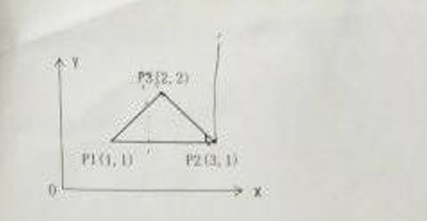

一、简答题（每题5分）

（1）试说明帧缓存及其深度的概念。

（2）请说明扫描转换或光栅化的含义。

（3）请举例说明加色模型。

（4）请解释双缓存的作用。

（5）试说明向量空间维数的概念。

（6）请说明其次坐标的概念。

二、论述题（每题8分）

（1）请描述逻辑设备的类型及其对应的功能。

（2）试写出LookAt 函数的形式并解释其功能。

（3）试述改进的Phong模型的意义，并解释半角向量的作用。

（4）试述参数连续与几何连续的区别，并说明几何连续在图像学中的作用。

（5）试述梁友栋-Barsky 算法思路，及其与Cohen-Sutherland 算法的特点。

三、计算题（每题10分）

（1）请使用 Bresenham 中点画线算法生成直线段P1(0,0)，P2(7,5)，要求写出生成过程中像素点的坐标及其判别式的值。

（2）如图所示，三点P1(1,1)，P2(3,1)与P3(2,2)定义了一个三角形，三角形相对于P2点顺时针旋转45度，请写出相应的组合变换矩阵，并求变换后P1与P3的坐标。

（3）已知四个控制点P0(4,1,1)，P1(0,0,0)，P2(3,0,3)和P3(-1,1,1)，请请构造一条三次B样条曲线，写出该曲线的参数表达式，并计算参数为 2/3和1时曲线上点的值。